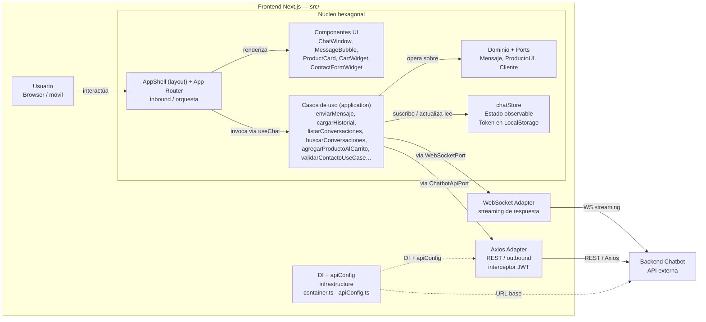
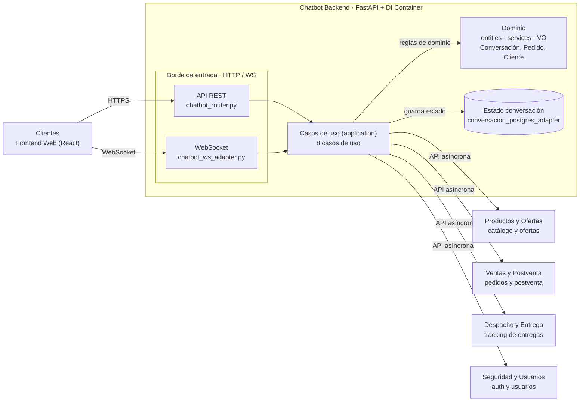

# Canal Chatbot — Especificaciones (SDD)

**Módulo:** Canal Chatbot (Cliente) · Marketplace Multicanal de productos deportivos · UNMSM 2026-II
**Actor principal:** Cliente final
**Canal:** solo web, **de uso mobile-first**. Es una aplicación propia de pantalla completa (patrón tipo ChatGPT/WhatsApp Web), no un widget embebido en otro módulo. Tiene su propio frontend y backend, igual que el resto de los módulos del curso.

Este repositorio es la **fuente de verdad de las especificaciones** del Canal Chatbot, gestionadas con [OpenSpec](https://github.com/Fission-AI/OpenSpec) y el flujo SDD de gentle-ai. No contiene código de aplicación: el backend y el frontend viven en repositorios hermanos (`G3-Chatbot-backend` y `G3-Chatbot-frontend`).

Hay una especificación por capacidad, en `openspec/specs/<capacidad>/`. Cada capacidad tiene dos archivos:

- **`spec.md` (comportamiento):** Propósito, Contexto, Alcance y Fuera de alcance, Requisitos con escenarios, requisitos no funcionales y Criterio de completitud.
- **`design.md` (implementación):** las cuatro secciones para derivar issues:
  - **Integraciones:** los endpoints de otros módulos que consume, indicando si el contrato está confirmado o es provisional.
  - **Frontend:** los componentes React y su comportamiento.
  - **Backend:** los endpoints propios, los servicios y la persistencia.
  - **Desglose para issues:** tareas etiquetadas `[FE]`, `[BE]`, `[INT]` y `[QA]`.

Documentos transversales:

| Documento | Contenido |
|---|---|
| [`docs/contratos-integracion.md`](docs/contratos-integracion.md) | API propia del chatbot, endpoints consumidos de cada módulo, mapeo de estados y acuerdos pendientes |
| [`docs/modelo-datos.md`](docs/modelo-datos.md) | Tablas de la base de datos propia del chatbot |
| [`docs/producto/`](docs/producto/README.md) | Capa de producto sobre las specs: alcance, épicas, historias de usuario, reglas de negocio, Definición de Listo y de Terminado, y trazabilidad (no reemplaza a las specs) |

> Esta versión incorpora la arquitectura hexagonal (frontend y backend) y los wireframes mobile ya definidos por el equipo. Las secciones marcadas 🧩 reflejan decisiones tomadas a partir de esos artefactos; lo que no estaba explícito en ellos queda anotado como supuesto.

---

## 1. Arquitectura

El sistema se organiza en **arquitectura hexagonal (puertos y adaptadores) tanto en el frontend como en el backend**, cada uno con su propio núcleo de dominio y casos de uso independientes del framework.

### 1.1 Frontend — Next.js (App Router) hexagonal

### 1.2 Backend — FastAPI hexagonal

Los **8 casos de uso** del núcleo backend agrupan las 22 specs de este repositorio:

| Caso de uso | Agrupa |
|---|---|
| `GestionarConversacionUseCase` | SPEC-05 (crear, listar, buscar, cargar historial) |
| `InterpretarYResponderUseCase` | SPEC-05 (tool calling, streaming por WebSocket) |
| `GestionarCatalogoUseCase` | SPEC-06, 07, 08, 09 |
| `GestionarCarritoUseCase` | SPEC-10, 11, 13 |
| `GestionarCheckoutUseCase` | SPEC-12, 14 |
| `GestionarPedidoUseCase` | SPEC-15, 16, 17 |
| `GestionarSeguimientoUseCase` | SPEC-18 |
| `GestionarPostventaUseCase` | SPEC-19, 20, 21, 22 |

> 🧩 Esta agrupación en 8 casos de uso es una propuesta para alinear las specs con el diagrama de arquitectura; el equipo debe confirmarla contra el código o ajustar los nombres.

### 1.3 Principios

1. **El backend sigue siendo un BFF.** El frontend solo habla con el backend del chatbot; es este quien llama a los demás módulos. Los tokens de servicio hacia Productos, Ventas, Despacho y Seguridad se gestionan en el backend, nunca en el navegador.
2. **Doble protocolo, un solo caso de uso.** El REST atiende las acciones que crean o modifican estado (agregar al carrito, pagar, etc.) y las lecturas puntuales; el **WebSocket se usa únicamente para el streaming de la respuesta del asistente** (efecto "escribiendo en vivo"), token por token, sobre la misma conversación. Ninguna acción con efecto (pagar, enviar un reclamo) se dispara por WebSocket.
3. **Doble vía de entrada, una sola lógica.** Cada acción se puede disparar por texto libre (el LLM decide la herramienta) o por un botón de la UI (la acción va directo al caso de uso, sin LLM). Las dos vías ejecutan el mismo caso de uso.
4. **El LLM no inventa datos.** Precios, stock, estados de pedido y descuentos provienen siempre de las herramientas. Las tarjetas y los resúmenes se renderizan con esos datos estructurados, no con el texto del LLM.
5. **Los datos sensibles nunca pasan por el LLM.** Contraseñas, códigos OTP y datos de tarjeta se capturan en formularios seguros de la UI y se envían a endpoints dedicados.
6. **Sin acceso a bases de datos ajenas.** Todo se hace por API, según la matriz del curso. El chatbot es dueño de: conversaciones, carrito, checkout, intentos de pago simulados y referencias locales a pedidos, reclamos y solicitudes de devolución.
7. **Nunca se asume disponibilidad.** Si un módulo no responde, la operación se rechaza de forma controlada y se informa al cliente.
8. **Next.js solo como frontend.** Next.js aporta el enrutamiento (App Router) y el renderizado de la interfaz; no actúa como BFF. No se usan Route Handlers, Server Actions ni componentes de servidor para llamar al backend del chatbot ni a otros módulos. Las pantallas que dependen de la sesión, el chat o el carrito son componentes de cliente (`'use client'`), porque el token vive en LocalStorage y no existe en el servidor. La configuración de servidor de Next se limita a cabeceras de seguridad como la `Content-Security-Policy`.

### 1.4 Token y sesión — decisión del equipo

El frontend guarda el `accessToken` en **`chatStore` respaldado por LocalStorage** (según la arquitectura del equipo), con el interceptor de Axios adjuntándolo en cada llamada REST y en el *handshake* del WebSocket. Esto reemplaza el patrón de cookie `httpOnly` + refresh por el BFF que se había propuesto antes.

> 🧩 **Riesgo aceptado:** guardar el token en LocalStorage lo expone a robo vía XSS (a diferencia de una cookie `httpOnly`). Mitigaciones mínimas que las specs de identidad (SPEC-01 a SPEC-04) deben implementar:
> - Sanitizar todo contenido que se renderiza desde el LLM o desde otros módulos (nunca `dangerouslySetInnerHTML` con texto no controlado).
> - Cabecera `Content-Security-Policy` estricta en el frontend.
> - `accessToken` de vida corta (los 15 min que ya define Seguridad) y `refreshToken` **fuera de LocalStorage**, en cookie `httpOnly` gestionada por el backend, para que un XSS robe como máximo 15 minutos de sesión.
> - Cierre de sesión en el backend (`POST /auth/logout`) invalida también el refresh.

### 1.5 Stack

| Capa | Tecnología |
|---|---|
| Frontend | Next.js (App Router, usado solo como frontend) + React + TypeScript, arquitectura hexagonal propia (`inbound/`, `application/`, `domain/`, `outbound/`, `infrastructure/`), TanStack Query, Zustand (`chatStore`), React Hook Form + Zod, Tailwind CSS |
| Backend | Python 3.12, **FastAPI** (`chatbot_router.py` REST, `chatbot_ws_adapter.py` WebSocket), arquitectura hexagonal (`domain/`, `application/`, `adapters/inbound/`, `adapters/outbound/`), Pydantic v2, SQLAlchemy 2 + Alembic, httpx async, PyJWT (JWKS), APScheduler para el worker de outbox |
| LLM | Adaptador `LLMProvider` (puerto outbound) con implementaciones Claude y OpenAI (tool calling); el streaming de la respuesta se empuja al frontend por `chatbot_ws_adapter.py` |
| Base de datos | PostgreSQL (`conversacion_postgres_adapter`) |
| Correo | SMTP (Mailtrap en desarrollo) |
| Pruebas | pytest, respx (mocks HTTP), Prism para el mock de Seguridad, Vitest + Testing Library, Playwright (E2E) |
| Diseño | Figma |

> ✅ **Aprobado por el profesor:** los lineamientos del curso listan Java Spring Boot, .NET Core o Node.js como backend; el equipo optó por Python/FastAPI y el profesor lo aceptó.

---

## 2. Pantallas de la aplicación 🧩

A partir de los wireframes mobile del equipo, la app tiene esta navegación (todas a pantalla completa, no como superposición):

| Pantalla | Contenido | Specs relacionadas |
|---|---|---|
| **Inicio** (`HomePage`, ruta `/`) | Banner de ofertas, grid de "Productos en oferta", campo de chat en la parte inferior. Combina catálogo y conversación en una sola vista de entrada. | SPEC-06, 08, 09, 05 |
| **Barra lateral** (`Sidebar`, overlay) | "Nuevo chat", "Buscar chats", "Historial" de conversaciones, lista de recientes, perfil del usuario con acceso a configuración | SPEC-05 |
| **Conversación** (`ChatPage`, ruta `/chat/[id]`) | Historial de mensajes de una conversación, tarjetas de producto inline, entrada de texto | SPEC-05 a 09 |
| **Carrito** (`CartPage`, ruta `/carrito`, pantalla completa vía ícono con badge) | Líneas, cantidades, subtotal, botón de pago | SPEC-10, 11, 13 |
| **Checkout** (`CheckoutPage`, ruta `/checkout`) | Total a pagar, dirección de envío (campos libres), método de pago (**solo tarjeta**) | SPEC-12, 14 |
| **Historial de pedidos** (`OrderHistoryPage`, ruta `/pedidos`, pestañas) | "En proceso", "Entregados", "Reembolsos" | SPEC-17, 18, 21, 22 |

> 🧩 El wireframe de checkout mostraba también "Efectivo / Pago contra entrega"; se retira porque el curso pide explícitamente **simulación de pago con tarjeta** para este canal (ver SPEC-14, sección *Fuera de alcance*).
> 🧩 La pestaña "Reembolsos" del historial se cubre con las specs nuevas SPEC-21 y SPEC-22, coordinadas con F3 (Devoluciones y cambios) y F4 (Reembolsos y extornos) de Ventas y Postventa.
> 🧩 El checkout del wireframe captura la dirección en campos libres (nombre, dirección exacta, referencia) en vez de elegir entre direcciones guardadas de Seguridad. SPEC-12 se ajustó a ese flujo, con la opción de guardarla en Seguridad para la próxima compra.

---

## 3. Índice de especificaciones

| ID | Capacidad | Especificación | Grupo | Requiere sesión |
|---|---|---|---|---|
| [SPEC-01](openspec/specs/registro-cliente/spec.md) | `registro-cliente` | Registro de cliente | Identidad | No |
| [SPEC-02](openspec/specs/verificacion-correo/spec.md) | `verificacion-correo` | Verificación de correo | Identidad | No |
| [SPEC-03](openspec/specs/inicio-sesion/spec.md) | `inicio-sesion` | Inicio de sesión, MFA y gestión de sesión | Identidad | — |
| [SPEC-04](openspec/specs/validacion-celular/spec.md) | `validacion-celular` | Validación de celular por OTP | Identidad | Sí |
| [SPEC-05](openspec/specs/motor-conversacion/spec.md) | `motor-conversacion` | Motor de conversación, conversaciones múltiples e interpretación de intención | Transversal | No |
| [SPEC-06](openspec/specs/busqueda-filtrado/spec.md) | `busqueda-filtrado` | Búsqueda y filtrado de productos | Descubrimiento | No |
| [SPEC-07](openspec/specs/recomendacion/spec.md) | `recomendacion` | Recomendación por necesidad | Descubrimiento | No |
| [SPEC-08](openspec/specs/ofertas-promociones/spec.md) | `ofertas-promociones` | Consulta de ofertas y promociones | Descubrimiento | No |
| [SPEC-09](openspec/specs/tarjetas-detalle-producto/spec.md) | `tarjetas-detalle-producto` | Carrusel, tarjetas y detalle de producto | Descubrimiento | No |
| [SPEC-10](openspec/specs/validacion-stock/spec.md) | `validacion-stock` | Validación de stock | Carrito | No |
| [SPEC-11](openspec/specs/gestion-carrito/spec.md) | `gestion-carrito` | Gestión del carrito | Carrito | No |
| [SPEC-12](openspec/specs/direccion-cotizacion-envio/spec.md) | `direccion-cotizacion-envio` | Dirección de entrega y cotización de envío | Checkout | Sí |
| [SPEC-13](openspec/specs/cupones/spec.md) | `cupones` | Cupones de descuento | Checkout | Sí |
| [SPEC-14](openspec/specs/checkout-pago/spec.md) | `checkout-pago` | Checkout y simulación de pago con tarjeta | Checkout | Sí |
| [SPEC-15](openspec/specs/grabacion-pedido/spec.md) | `grabacion-pedido` | Grabación del pedido | Checkout | Sí |
| [SPEC-16](openspec/specs/notificacion-confirmacion/spec.md) | `notificacion-confirmacion` | Notificación de confirmación por correo | Checkout | Sí |
| [SPEC-17](openspec/specs/consulta-estado-pedido/spec.md) | `consulta-estado-pedido` | Consulta de estado del pedido | Seguimiento | Sí |
| [SPEC-18](openspec/specs/seguimiento-despacho/spec.md) | `seguimiento-despacho` | Seguimiento del despacho en ruta | Seguimiento | Sí |
| [SPEC-19](openspec/specs/creacion-reclamo/spec.md) | `creacion-reclamo` | Creación de reclamo | Postventa | Sí |
| [SPEC-20](openspec/specs/consulta-reclamo/spec.md) | `consulta-reclamo` | Consulta de estado y respuesta del reclamo | Postventa | Sí |
| [SPEC-21](openspec/specs/solicitud-devolucion-cambio/spec.md) | `solicitud-devolucion-cambio` | Solicitud de devolución o cambio | Postventa | Sí |
| [SPEC-22](openspec/specs/consulta-devolucion-reembolso/spec.md) | `consulta-devolucion-reembolso` | Consulta de estado de devolución y reembolso | Postventa | Sí |

### Orden sugerido de implementación

1. **Hito 3 (demo 1):** SPEC-05 (base del chat, conversaciones múltiples y herramientas), 06, 09, 10, 11, 01, 02 y 03.
2. **Hito 4 (integración):** SPEC-04, 07, 08, 12, 13, 14, 15 y 16.
3. **Hito 5–6:** SPEC-17 a SPEC-22, más el endurecimiento de los RNF y las pruebas de performance.

---

## 4. Trazabilidad con los lineamientos del curso

| Lineamiento (Canal Chatbot) | Specs |
|---|---|
| Consulta conversacional de productos mediante lenguaje natural | SPEC-05, SPEC-06 |
| Búsqueda de productos por características: precio, categoría, marca | SPEC-06, SPEC-09 |
| Recomendación de productos según necesidades | SPEC-07 |
| Consulta de ofertas y promociones | SPEC-08, SPEC-13 |
| Agregar productos al carrito mediante conversación | SPEC-10, SPEC-11 |
| Validación del número celular y correo del cliente | SPEC-02, SPEC-04 |
| Grabación del pedido y pago con tarjeta | SPEC-12, SPEC-14, SPEC-15 |
| Notificaciones por correo del pedido al cliente | SPEC-16 |
| Consulta del estado de un pedido | SPEC-17, SPEC-18 |
| (Extensión) Registro e inicio de sesión | SPEC-01, SPEC-03 |
| (Extensión) Reclamos desde el canal | SPEC-19, SPEC-20 |
| (Extensión, a partir del wireframe de historial) Devoluciones, cambios y reembolsos | SPEC-21, SPEC-22 |

---

## 5. Convenciones

- **Formato de API:** JSON en `camelCase`, enumeraciones en `UPPER_SNAKE_CASE`, fechas ISO 8601 en UTC y moneda `PEN` con 2 decimales. En la interfaz, las fechas se muestran en hora de Lima (UTC-5).
- **Errores de la API propia:** `application/problem+json` con campo `code`, alineado con Seguridad. El frontend ramifica por `code`, nunca por el texto.
- **Idempotencia:** toda operación que crea algo en otro módulo o mueve dinero (pedido, pago, reclamo, solicitud de devolución) lleva un `Idempotency-Key`.
- **Contratos provisionales:** donde el otro módulo aún no publicó su contrato, la spec lo marca como **(provisional)**. La lista completa está en [`docs/contratos-integracion.md`](docs/contratos-integracion.md) §6.
- **Criterios de aceptación:** cada escenario DADO/CUANDO/ENTONCES debe tener al menos una prueba automatizada que lo referencie por nombre.

---

## 6. Cómo trabajar con OpenSpec

- **Specs principales:** `openspec/specs/<capacidad>/spec.md` es la línea base vigente de cada capacidad; `design.md` guarda el detalle de implementación. No se editan a mano para introducir cambios de comportamiento.
- **Cambios:** todo cambio nuevo se trabaja en `openspec/changes/<cambio>/` mediante el flujo SDD de gentle-ai (exploración, propuesta, specs delta, diseño, tareas, aplicación, verificación y archivo). Al archivar, las specs delta se fusionan en `openspec/specs/` y el cambio se mueve a `openspec/changes/archive/`.
- **Validación:** `npx @fission-ai/openspec validate --specs --strict` comprueba el formato de todas las specs.
- **Formato híbrido:** el contenido está en español neutro y profesional, pero las palabras clave estructurales de OpenSpec se mantienen en inglés para que el parser y las fusiones de archivo funcionen:
  - Encabezados `## Purpose`, `## Requirements`, `### Requirement: <nombre en español>` y `#### Scenario: <nombre en español>`.
  - La primera oración de cada requisito incluye la palabra clave RFC 2119 en español con su equivalente en inglés entre paréntesis: `DEBE (SHALL)`, `NO DEBE (SHALL NOT)`, `DEBERÍA (SHOULD)`, `PUEDE (MAY)`.
  - Los escenarios se escriben como viñetas con Gherkin en español y en negrita: `- **DADO** …`, `- **CUANDO** …`, `- **ENTONCES** …`, `- **Y** …`.
  - Cada requisito tiene al menos un escenario y una línea *Trazabilidad* con su SPEC y número de requisito de origen.
- **Configuración:** las reglas del proyecto para SDD están en `openspec/config.yaml`.
