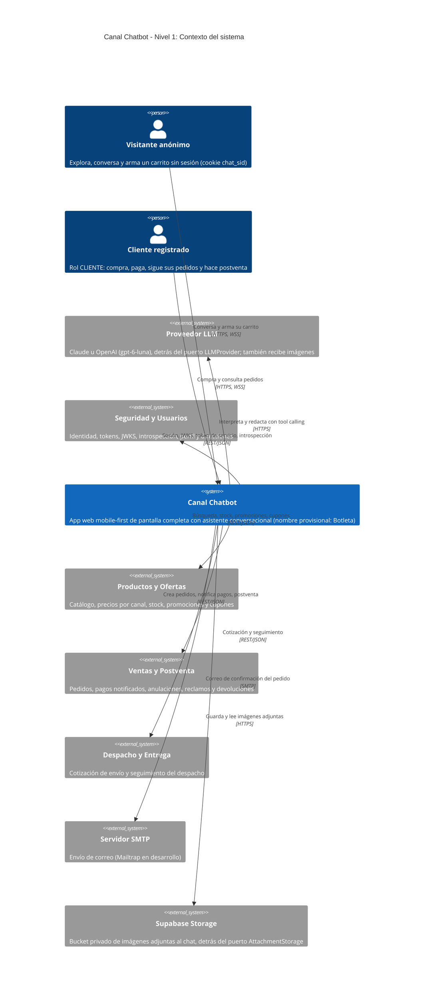
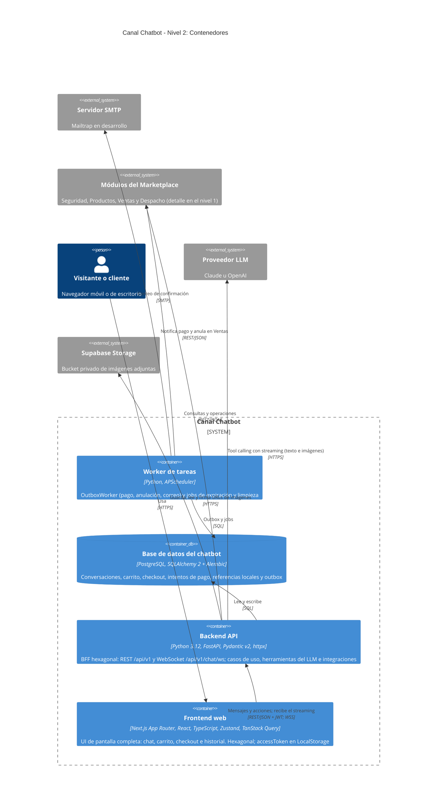
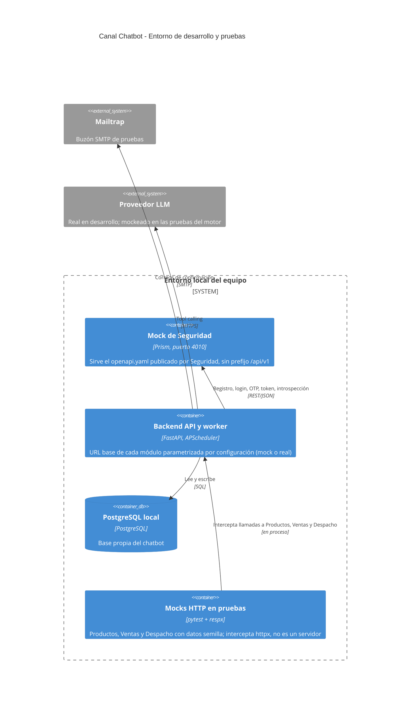
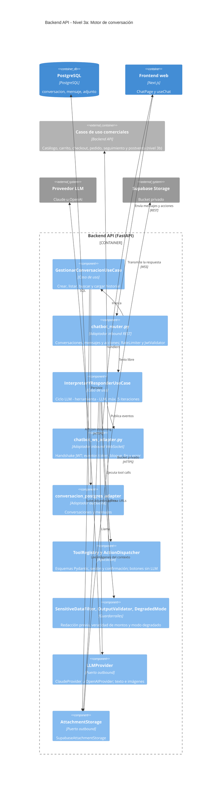
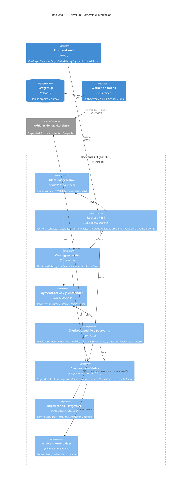

# Modelo C4 — Canal Chatbot

> Vistas de arquitectura del Canal Chatbot según el [modelo C4](https://c4model.com). Todo lo que aparece aquí proviene del [README §1](../../README.md#1-arquitectura), de los `design.md` de [`openspec/specs/`](../../openspec/specs/), de [`contratos-integracion.md`](../contratos-integracion.md) y de [`modelo-datos.md`](../modelo-datos.md). Si un diagrama contradice a una spec, manda la spec y este documento se corrige.

**Cómo leer los diagramas**

- Están escritos con la sintaxis C4 de Mermaid (`C4Context`, `C4Container`, `C4Component`), que GitHub renderiza directamente. Esa sintaxis es experimental: el acomodo automático reparte los elementos en filas según el ancho de la pantalla, por lo que en una pantalla angosta algunas flechas pueden cruzar cajas. Las tablas bajo cada diagrama son la referencia exacta.
- Se omite a propósito el **nivel 4 (código)**: la estructura de clases vive en los repositorios `G3-Chatbot-backend` y `G3-Chatbot-frontend`, y la documentarían mejor sus propias herramientas.
- Las decisiones que explican estas vistas están en los [ADR](adr/README.md).

## Contenido

1. [Nivel 1 — Contexto del sistema](#nivel-1--contexto-del-sistema)
2. [Nivel 2 — Contenedores](#nivel-2--contenedores)
3. [Entorno de desarrollo y pruebas](#entorno-de-desarrollo-y-pruebas)
4. [Nivel 3 — Componentes del backend](#nivel-3--componentes-del-backend)
5. [Vista dinámica](#vista-dinámica)
6. [Preguntas abiertas](#preguntas-abiertas)

---

## Nivel 1 — Contexto del sistema

Quién usa el Canal Chatbot y de qué sistemas depende. El canal no es dueño del catálogo, del stock, de los usuarios, de los pedidos ni de los despachos: los consulta por API ([ADR-0013](adr/ADR-0013-solo-referencias-locales-a-agregados-externos.md)).

| Elemento | Tipo | Responsabilidad | Referencia |
|---|---|---|---|
| Visitante anónimo | Persona | Conversa, busca, recibe recomendaciones y arma un carrito anónimo, sin sesión; sus conversaciones se ligan a la cookie `chat_sid` | [`alcance.md` §2](../producto/alcance.md#2-usuarios-y-roles); SPEC-05 a SPEC-11 |
| Cliente registrado | Persona | Token con rol `CLIENTE`: carrito persistente, checkout (con celular verificado), pedidos, reclamos, devoluciones y reembolsos | SPEC-03, SPEC-04 · Req. 1, SPEC-14 · Req. 1 |
| Canal Chatbot | Sistema (en alcance) | Aplicación web propia, mobile-first y de pantalla completa. El asistente se presenta con el nombre de `ASSISTANT_NAME` (provisional: "Botleta") | [README](../../README.md); SPEC-05 · Req. 12 |
| Seguridad y Usuarios | Sistema externo | Registro, login, MFA, refresh, perfil, direcciones, JWKS, token de servicio `client_credentials` e introspección. También envía el correo de verificación de cuenta, cuyo enlace lleva al frontend del chatbot (`canalOrigen: "CHATBOT"`) | [`contratos-integracion.md` §3.1](../contratos-integracion.md#31-seguridad-y-usuarios--base-segapiv1-mock-prism-en-4010-sin-prefijo); A1, A3 |
| Productos y Ofertas | Sistema externo | Catálogo, precios por canal, disponibilidad, promociones, evaluación de cupones y candidatos de recomendación. Rutas aún provisionales (A5) | [`contratos-integracion.md` §3.2](../contratos-integracion.md#32-productos-y-ofertas--base-proapiv1--las-specs-definen-las-capacidades-las-rutas-son-una-propuesta) |
| Ventas y Postventa | Sistema externo | Pedidos (crear, notificar pago, anular, consultar), reclamos y devoluciones con evidencia | [`contratos-integracion.md` §3.3](../contratos-integracion.md#33-ventas-y-postventa--bases-venapiv1-m1--f1-f2-y-venapiv2-m2--f3-f4-f5-f6--contrato-publicado-v130) |
| Despacho y Entrega | Sistema externo | Cotización de envío (`POST /zonas/cotizar`) y seguimiento por pedido (provisional, A11) | [`contratos-integracion.md` §3.4](../contratos-integracion.md#34-despacho-y-entrega--base-desapiv1) |
| Proveedor LLM | Sistema externo | Claude u OpenAI, elegido por configuración, detrás del puerto `LLMProvider`. Con SPEC-23 recibe también imágenes en base64 (modelo `gpt-6-luna`, soporte de visión sin verificar) | SPEC-05 · RNF *Configuración*; [ADR-0005](adr/ADR-0005-llm-con-tool-calling-detras-de-llmprovider.md); [ADR-0019](adr/ADR-0019-imagenes-como-entrada-del-llm.md) |
| Servidor SMTP | Sistema externo | Entrega el correo de confirmación del pedido al cliente (Mailtrap en desarrollo) | SPEC-16 · RNF *Seguridad* |
| Supabase Storage | Sistema externo | Bucket privado con las imágenes que el cliente adjunta al chat (SPEC-23). Solo se accede desde el backend, que emite URLs firmadas de corta vida para las miniaturas | SPEC-23; [ADR-0019](adr/ADR-0019-imagenes-como-entrada-del-llm.md) |

Notas:

- **Ventas no recibe las imágenes del chat.** La evidencia de devolución (SPEC-21) se sube a Ventas desde su formulario; las imágenes adjuntas al chat viven solo en el bucket propio del canal.
- **El pago y el SMS no son sistemas externos.** El pago se procesa con un simulador propio detrás de `PaymentGateway` ([ADR-0014](adr/ADR-0014-pago-simulado-detras-de-paymentgateway.md)) y el OTP del celular sale por un `SimulatedSmsSender` propio ([ADR-0015](adr/ADR-0015-verificacion-propia-del-celular-por-otp.md)). Ambos viven dentro del backend (nivel 3b).
- **Marketplace y Retail** son canales hermanos que consumen los mismos módulos; el chatbot no se integra con ellos. La verificación local del celular no se comparte con esos canales (SPEC-04 · *Fuera de alcance*).
- El Gestor de Ventas y el Gestor Comercial de Productos deciden sobre datos que el chatbot muestra (respuestas a reclamos, resoluciones, promociones), pero no usan el canal ([`alcance.md` §2](../producto/alcance.md#2-usuarios-y-roles)).
- Los usuarios con token sin rol `CLIENTE` no pueden comprar: se les cierra la sesión (SPEC-03 · Req. 1).

---

## Nivel 2 — Contenedores

Las unidades ejecutables del Canal Chatbot y cómo se comunican. Los cuatro módulos del Marketplace se agrupan en una sola caja para no recargar la vista; el detalle por módulo está en el nivel 1.

| Elemento | Tipo | Tecnología | Responsabilidad | Referencia |
|---|---|---|---|---|
| Frontend web | Contenedor | Next.js (App Router, solo como frontend) + React + TypeScript, Zustand (`chatStore`), TanStack Query, React Hook Form + Zod, Tailwind CSS | Pantallas `HomePage`, `ChatPage`, `CartPage`, `CheckoutPage`, `OrderHistoryPage` y `Sidebar`. Arquitectura hexagonal (`inbound/`, `application/`, `domain/`, `outbound/`, `infrastructure/`). Adaptador Axios (REST con interceptor JWT) y adaptador WebSocket (reconexión y *fallback* a *polling*). Guarda el `accessToken` en LocalStorage | [README §1.1, §1.3.8, §1.4, §1.5](../../README.md#11-frontend--nextjs-app-router-hexagonal); `motor-conversacion/design.md` |
| Backend API | Contenedor | Python 3.12, FastAPI, Pydantic v2, SQLAlchemy 2 + Alembic, httpx async, PyJWT (JWKS) | BFF: único punto de entrada del frontend. REST en `/api/v1` (`chatbot_router.py` y routers por recurso) y WebSocket en `/api/v1/chat/ws` (`chatbot_ws_adapter.py`) **solo** para transmitir la respuesta del asistente. Aloja los casos de uso, las herramientas del LLM y los clientes de los módulos. Sin estado en memoria: la conversación vive en PostgreSQL para permitir varias réplicas | [README §1.2, §1.3](../../README.md#12-backend--fastapi-hexagonal); [`contratos-integracion.md` §2](../contratos-integracion.md#2-api-expuesta-por-el-backend-del-chatbot-para-su-frontend); SPEC-05 · RNF *Escalabilidad del WebSocket* |
| Worker de tareas | Contenedor | Python, APScheduler | `OutboxWorker` (tareas `NOTIFICAR_PAGO_VENTAS`, `SOLICITAR_ANULACION`, `ENVIAR_CORREO`, con backoff exponencial) y jobs programados: `ExpirarCheckouts` (cada minuto), limpieza de carritos anónimos (7 días), de referencias de evidencia de borradores (24 h) y de adjuntos de chat pendientes o huérfanos (24 h, SPEC-23) | README §1.5; `grabacion-pedido/design.md`, `checkout-pago/design.md`, `gestion-carrito/design.md`, `solicitud-devolucion-cambio/design.md`; [ADR-0011](adr/ADR-0011-outbox-transaccional.md) |
| Base de datos del chatbot | Contenedor (datos) | PostgreSQL | Tablas propias: `conversacion`, `mensaje`, `adjunto`, `carrito`, `item_carrito`, `checkout`, `intento_pago`, `celular_verificacion_local`, `pedido_ref`, `notificacion`, `reclamo_ref`, `devolucion_ref`, `evidencia`, `outbox` | [`modelo-datos.md`](../modelo-datos.md) |
| Supabase Storage | Sistema externo (almacenamiento) | Bucket privado de Supabase Storage | Guarda la imagen normalizada y la miniatura de cada adjunto del chat; la base solo guarda las claves (`adjunto`). Sin lectura pública: el backend lee los bytes y emite URLs firmadas de corta vida | SPEC-23; [ADR-0019](adr/ADR-0019-imagenes-como-entrada-del-llm.md) |

**Protocolos**

| Origen → destino | Protocolo | Uso |
|---|---|---|
| Frontend → Backend API | HTTPS REST/JSON, `Authorization: Bearer <accessToken>`; errores `application/problem+json` con `code` | Crear, listar y buscar conversaciones, enviar mensajes (`202 {mensajeId}`) y ejecutar acciones con efecto |
| Backend API → Frontend | WSS `wss://<host>/api/v1/chat/ws?conversacionId=<id>` | Eventos `token`, `bloque`, `fin` y `error`. El cliente nunca envía mensajes por este canal; si no conecta, *polling* de `GET /chat/conversaciones/{id}/mensajes?desde=` |
| Backend API / Worker → módulos | HTTPS REST/JSON con httpx | Token del cliente reenviado cuando el recurso es del titular; token de servicio `modulo-chatbot` para operaciones a nombre del sistema ([ADR-0009](adr/ADR-0009-token-de-servicio-con-servicetokenprovider.md)) |
| Backend API → Proveedor LLM | HTTPS (API del proveedor) | Tool calling con streaming; timeout de 15 s. Con SPEC-23, el contexto puede incluir imágenes en base64 |
| Backend API → Supabase Storage | HTTPS (API de Storage) | Guardar y leer imágenes adjuntas, emitir URLs firmadas y eliminar archivos huérfanos |
| Worker → SMTP | SMTP | Correo de confirmación del pedido |

> ⚠️ **Topología del worker no decidida.** El README fija APScheduler para el worker de outbox y los `design.md` describen los jobs, pero ningún documento dice si el worker corre como proceso aparte o dentro del proceso de la API. Se dibuja como contenedor separado porque tiene un ciclo de vida propio; ver [preguntas abiertas](#preguntas-abiertas).

---

## Entorno de desarrollo y pruebas

Solo aplica en desarrollo y en las pruebas automatizadas; no forma parte del despliegue. Explica cómo se integra el backend antes de contar con las APIs reales ([ADR-0017](adr/ADR-0017-mocks-y-urls-base-parametrizadas.md)).

| Elemento | Tipo | Responsabilidad | Referencia |
|---|---|---|---|
| Mock de Seguridad | Servidor mock (Prism, `:4010`) | Sirve el `openapi.yaml` de Seguridad sin el prefijo `/api/v1`; admite ejemplos por cabecera `Prefer` (`code=401`, `example=conMfa`…). Se usa con `client_secret=secreto-de-prueba` hasta el Hito 4 | [`contratos-integracion.md` §3.1](../contratos-integracion.md#31-seguridad-y-usuarios--base-segapiv1-mock-prism-en-4010-sin-prefijo); `inicio-sesion/design.md`; SPEC-14 · RNF |
| Mocks HTTP en pruebas | Biblioteca (pytest + respx) | Intercepta en el mismo proceso las llamadas httpx a Productos, Ventas y Despacho con datos semilla. No es un servidor | [`definicion-listo-terminado.md`](../producto/definicion-listo-terminado.md) R3, D2.1; `busqueda-filtrado/design.md` |
| Mailtrap | Servicio externo de pruebas | Buzón SMTP donde se revisa la plantilla del correo | SPEC-16 · RNF; `notificacion-confirmacion/design.md` |
| URL base parametrizada | Configuración | Cada cliente de módulo toma su URL base de la configuración, para apuntar al mock o al servicio real sin cambiar código | `registro-cliente/design.md` (`SeguridadClient`) |

El proveedor LLM y el WebSocket se mockean en las pruebas del motor de conversación (`motor-conversacion/design.md`, desglose `[QA]`).

---

## Nivel 3 — Componentes del backend

El backend sigue la arquitectura hexagonal del [README §1.2](../../README.md#12-backend--fastapi-hexagonal): adaptadores inbound (REST y WebSocket) → casos de uso (`application/`) → dominio (`domain/`: entidades, servicios y value objects como Conversación, Pedido y Cliente) → puertos outbound implementados por adaptadores (`adapters/outbound/`). Para que la vista sea legible se divide en dos diagramas:

- **3a — Motor de conversación:** cómo entra un mensaje, cómo se interpreta con el LLM y cómo sale la respuesta.
- **3b — Comercio e integración:** los casos de uso de catálogo, carrito, checkout, pedido y postventa, y los adaptadores hacia los módulos.

> 🧩 La agrupación en **8 casos de uso** es una propuesta del README pendiente de confirmar contra el código ([ADR-0018](adr/ADR-0018-agrupacion-del-nucleo-en-ocho-casos-de-uso.md)). Los nombres de servicios y adaptadores de las tablas salen de los `design.md`.

### 3a — Motor de conversación

| Componente | Tipo | Responsabilidad | Referencia |
|---|---|---|---|
| `chatbot_router.py` | Adaptador inbound (REST) | `POST/GET /chat/conversaciones`, `GET /chat/conversaciones/buscar`, `GET/POST /chat/conversaciones/{id}/mensajes` y, con SPEC-23, los endpoints de adjuntos (`/chat/conversaciones/{id}/adjuntos`, `/chat/adjuntos/{adjuntoId}`). Aplica `RateLimiter` (20 mensajes/min por cliente o IP) y `JwtValidator` (`get_cliente_actual`). Invoca `ChatbotServicePort` | `motor-conversacion/design.md`; SPEC-05 · Req. 1, 4, 11 |
| `chatbot_ws_adapter.py` | Adaptador inbound (WebSocket) | Handshake con JWT, suscripción por `conversacionId` (varias pestañas), reenvío de lo faltante al reconectar. Solo transmite, nunca ejecuta acciones | SPEC-05 · Req. 4; README §1.3.2 |
| `ChatbotServicePort` | Puerto inbound | Contrato único que ambos adaptadores exponen hacia los casos de uso (no se dibuja aparte) | `motor-conversacion/design.md` |
| `GestionarConversacionUseCase` | Caso de uso | Crear, listar, buscar y cargar historial; pertenencia por `cliente_id` o `chat_sid` | SPEC-05 · Req. 1 |
| `InterpretarYResponderUseCase` | Caso de uso | Arma el prompt (prompt del sistema, resumen y últimos 12 mensajes), llama al LLM, ejecuta herramientas (máx. 5 iteraciones, 1 reintento por validación), ensambla bloques y los publica por WebSocket | SPEC-05 · Req. 3, 4, 7; RNF *Contexto* |
| `ToolRegistry` | Aplicación | Catálogo de herramientas: nombre, descripción, esquema Pydantic, `requiere_sesion`, `requiere_confirmacion` y handler (un caso de uso). La identidad sale del token, nunca de los argumentos | SPEC-05 · Req. 3, 6 |
| `ActionDispatcher` | Aplicación | Enruta las acciones de botones (`{accion: {tipo, payload}}`) a los mismos handlers, sin LLM ni WebSocket | SPEC-05 · Req. 8; README §1.3.3 |
| `SensitiveDataFilter` | Servicio de dominio | Redacta tarjetas (Luhn), OTP, contraseñas y documentos precedidos por una palabra identificadora **antes** de persistir o llamar al LLM | SPEC-05 · Req. 9; [ADR-0006](adr/ADR-0006-datos-sensibles-fuera-del-llm.md) |
| `OutputValidator` | Servicio de dominio | Compara precios y montos del texto transmitido con los resultados de las herramientas y corrige en el evento `fin` | SPEC-05 · Req. 7 |
| `DegradedMode` | Aplicación | Intérprete de palabras clave y menú cuando el LLM falla, excede 15 s o no está configurado | SPEC-05 · Req. 10 |
| `LLMProvider` + `ClaudeProvider` / `OpenAIProvider` | Puerto outbound + adaptadores | Llamada con tools, streaming y timeouts; proveedor, modelo, temperatura y `max_tokens` por variables de entorno. Con SPEC-23 admite partes de contenido de imagen (base64) y declara si el modelo admite visión | SPEC-05 · RNF *Configuración*; SPEC-23 |
| `AttachmentStorage` → `SupabaseAttachmentStorage` | Puerto outbound + adaptador | `guardar`, `leer`, `eliminar` y `url_firmada` sobre un bucket privado de Supabase Storage. Lo usan `GestionarConversacionUseCase` (carga y URLs firmadas) e `InterpretarYResponderUseCase` (lectura de imágenes para el LLM). Se reemplaza por un adaptador en memoria en las pruebas | SPEC-23; [ADR-0019](adr/ADR-0019-imagenes-como-entrada-del-llm.md) |
| `conversacion_postgres_adapter` | Adaptador outbound | Persistencia de `conversacion`, `mensaje` y, con SPEC-23, las referencias `adjunto` | README §1.2; [`modelo-datos.md`](../modelo-datos.md) |
| `prompts/sistema.md`, `evals/` | Artefactos versionados | Prompt del sistema y evaluación de intención (`pytest -m evals`, precisión ≥ 90 % en CI) | SPEC-05 · RNF *Calidad* |

### 3b — Comercio e integración

| Componente | Tipo | Responsabilidad | Referencia |
|---|---|---|---|
| Routers REST | Adaptadores inbound | `/sesion/*`, `/contacto/celular/*`, `/catalogo/*`, `/carrito*`, `/direcciones`, `/envio/cotizar`, `/checkout*`, `/pedidos*`, `/reclamos*`, `/evidencias`, `/devoluciones*`. Las mismas operaciones que usan las herramientas del LLM | [`contratos-integracion.md` §2](../contratos-integracion.md#2-api-expuesta-por-el-backend-del-chatbot-para-su-frontend) |
| Identidad y sesión | Servicios de aplicación | `SesionService.post_login()` (liga la conversación, fusiona carritos, retoma la `accionPendiente`), `JwtValidator` (JWKS cacheado, rol `CLIENTE`), `CheckoutGuard.exigir_celular_verificado()`. Fija las cookies `chat_rt` y `chat_chg` | `inicio-sesion/design.md`, `validacion-celular/design.md` |
| `GestionarCatalogoUseCase` | Caso de uso | `CatalogoService`, `Normalizador`, `RecomendacionService`, `CrossSellService`, `PromocionesService`, `PricingAdapter`, `VarianteResolver`, `StockValidator`, `SimilaresService` | SPEC-06 a SPEC-10 (design.md) |
| `GestionarCarritoUseCase` | Caso de uso | `CarritoService`, `TotalesCalculator`, `ResolverLineaCarrito`, `CuponService` (y validación de stock de SPEC-10) | SPEC-10, 11, 13 |
| `GestionarCheckoutUseCase` | Caso de uso | `CheckoutService` (precondiciones, revalidación, vigencia de 15 min, 3 intentos), `EnvioService`, `DocumentoValidator`, `CardValidator`, `GuardarDireccionOpcional` | SPEC-12, 14 |
| `GestionarPedidoUseCase` | Caso de uso | `PedidoService.crear_en_ventas()`, `SnapshotBuilder`, `NotificacionService`, `EstadoPedidoService`, `EstadoMapper` | SPEC-15, 16, 17 |
| `GestionarSeguimientoUseCase` | Caso de uso | Consulta a Despacho con `SeguimientoMapper` (lista blanca, sin coordenadas ni datos del repartidor) | SPEC-18 |
| `GestionarPostventaUseCase` | Caso de uso | `ReclamoService`, `ReclamoConsultaService`, `DevolucionService`, `DevolucionConsultaService` | SPEC-19 a 22 |
| `PaymentGateway` → `PaymentSimulator` | Puerto outbound + adaptador | Simulador determinista con tarjetas de prueba; reemplazable por una pasarela real | `checkout-pago/design.md`; [ADR-0014](adr/ADR-0014-pago-simulado-detras-de-paymentgateway.md) |
| `SmsSender` → `SimulatedSmsSender` | Puerto outbound + adaptador | Envío simulado del OTP de celular | `validacion-celular/design.md`; [ADR-0015](adr/ADR-0015-verificacion-propia-del-celular-por-otp.md) |
| Clientes de módulos | Adaptadores outbound (httpx) | `SeguridadClient`, `IntrospeccionClient` (3 s, sin caché), `ProductosClient`, `InventarioClient`, `CuponesClient`, `EvaluacionClient`, `VentasClient` (5 s, normaliza `codigo` → `code`), `DespachoClient` (4 s). Timeouts propios y URL base parametrizada | `design.md` de cada spec; [`contratos-integracion.md` §3](../contratos-integracion.md#3-endpoints-consumidos) |
| `ServiceTokenProvider` | Adaptador outbound | Obtiene y cachea el token `client_credentials` de `modulo-chatbot` hasta 60 s antes de su `exp`. Se construye en Hito 4 | `seguimiento-despacho/design.md`; [ADR-0009](adr/ADR-0009-token-de-servicio-con-servicetokenprovider.md) |
| Repositorios PostgreSQL | Adaptadores outbound | Persistencia de carrito, checkout, intentos de pago, verificación local, referencias y outbox. El checkout, el intento de pago y la tarea de outbox se escriben en la misma transacción | [`modelo-datos.md`](../modelo-datos.md); SPEC-15 · Req. 3 |
| Worker de tareas | Contenedor (nivel 2) | `OutboxWorker` y `EmailSender` → `SmtpEmailSender` (plantillas Jinja2). Lee el outbox y llama a Ventas y al SMTP; los errores `400`/`409` no se reintentan | `grabacion-pedido/design.md`, `notificacion-confirmacion/design.md` |

Notas:

- Los servicios de identidad (SPEC-01 a SPEC-04) no pertenecen a ninguno de los 8 casos de uso del README; se muestran como un grupo aparte (ver [preguntas abiertas](#preguntas-abiertas)).
- También hay un endpoint interno `/admin/outbox-fallidos` para revisar tareas agotadas (`grabacion-pedido/design.md`).

---

## Vista dinámica

No se repite aquí: la secuencia de un turno de texto (REST → `InterpretarYResponderUseCase` → `SensitiveDataFilter` → `LLMProvider` → `ToolRegistry` → módulo → WebSocket) está en [`flujos-conversacion.md` (e)](../conversacion/flujos-conversacion.md#e-secuencia-de-un-turno-de-texto), y el flujo de checkout y pago en [`flujos-conversacion.md` (c)](../conversacion/flujos-conversacion.md#c-checkout-y-pago).

---

## Preguntas abiertas

1. **Topología del worker.** ¿El `OutboxWorker` y los jobs de APScheduler corren como proceso separado o dentro del proceso de la API? Si la API corre con varias réplicas (SPEC-05 · RNF), un scheduler dentro de cada réplica ejecutaría los jobs más de una vez. *Propuesta:* un único proceso worker; confirmarlo al definir el despliegue.
2. **Despliegue.** Ningún documento define dónde se despliegan el frontend, el backend y la base de datos, por eso no hay vista de despliegue.
3. **Casos de uso de identidad.** La tabla de 8 casos de uso del README (§1.2) dice agrupar las 22 specs, pero no incluye SPEC-01 a SPEC-04. *Propuesta:* agregar un caso de uso de identidad (p. ej. `GestionarSesionUseCase`) al confirmar la agrupación ([ADR-0018](adr/ADR-0018-agrupacion-del-nucleo-en-ocho-casos-de-uso.md)).
