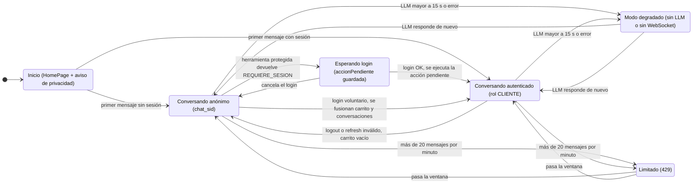
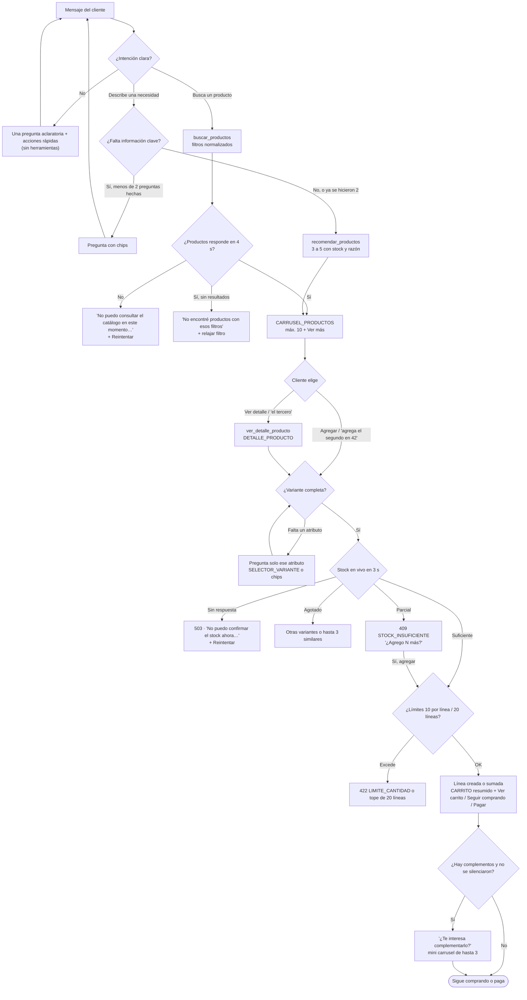
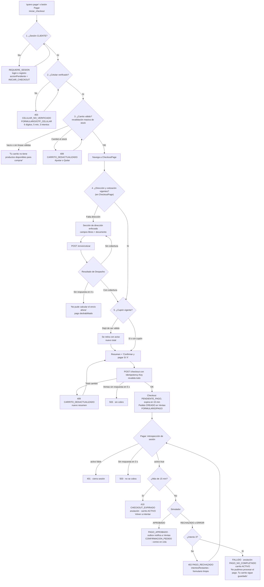
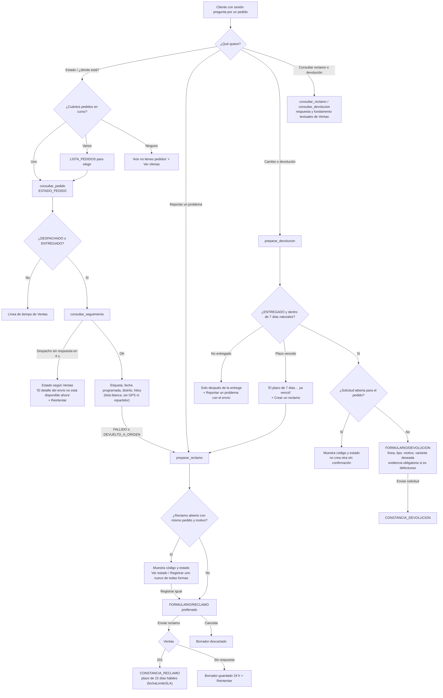
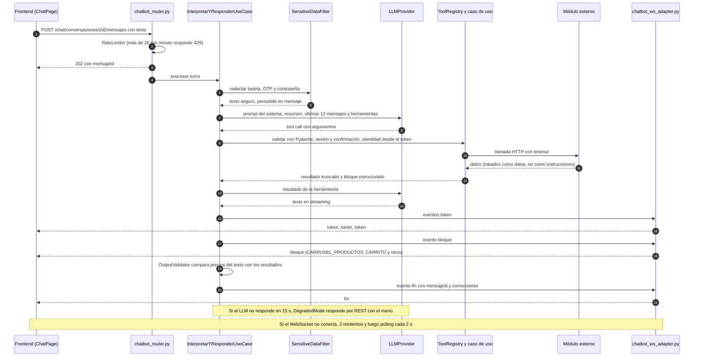

# Flujos de conversación

> Diagramas del diseño conversacional sobre las specs de [`openspec/specs/`](../../openspec/specs/). Resumen visual: el detalle normativo (textos, códigos, límites) está en cada spec citada. Los diagramas usan Mermaid y se renderizan en GitHub.

## (a) Máquina de estados global de la conversación

Estados de la **experiencia** del cliente, no de la tabla `conversacion` (cuyos estados son `ACTIVA`, `ARCHIVADA` y `CERRADA`, ver [`modelo-datos.md`](../modelo-datos.md)). "Degradado" y "Limitado" se superponen a la sesión: al salir de ellos se vuelve al estado de sesión anterior.

Fuentes: SPEC-05 · Req. 1, 2, 4, 10, 11, 12; SPEC-03 · Req. 1, 3, 5, 6.

Notas:
- La primera respuesta del asistente en cada conversación incluye la presentación como asistente virtual (SPEC-05 · Req. 12).
- Si el WebSocket falla, la respuesta llega por *polling* cada 2 s tras 2 reintentos (SPEC-05 · Req. 4); eso no cambia el estado de sesión.
- Si el LLM falla, las acciones directas por botón siguen funcionando porque no pasan por el LLM (SPEC-05 · Req. 8).

## (b) Descubrimiento → carrito

Fuentes: SPEC-05 · Req. 3, 5; SPEC-06 · Req. 1–5; SPEC-07 · Req. 1–3; SPEC-09 · Req. 1–4; SPEC-10 · Req. 1, 3; SPEC-11 · Req. 1.

## (c) Checkout y pago

El orden de precondiciones es el de SPEC-14 · Req. 1: sesión → celular verificado → carrito válido → dirección y cotización → cupón vigente. Sesión, celular, carrito y cupón se resuelven en el chat; **la dirección y la cotización se resuelven en `CheckoutPage`**, nunca por texto.

Fuentes: SPEC-14 · Req. 1–6; SPEC-03 · Req. 3; SPEC-04 · Req. 1–2; SPEC-10 · Req. 2; SPEC-11 · Req. 3; SPEC-12 · Req. 1–5; SPEC-13 · Req. 4; SPEC-15 · Req. 1–3; SPEC-16 · Req. 3.

## (d) Postventa: estado, seguimiento, reclamo y devolución

Fuentes: SPEC-17 · Req. 1–4; SPEC-18 · Req. 1–4; SPEC-19 · Req. 1–4; SPEC-20 · Req. 1–3; SPEC-21 · Req. 1–5; SPEC-22 · Req. 1–4.

## (e) Secuencia de un turno de texto

Un mensaje de texto viaja por REST y la respuesta vuelve por WebSocket (SPEC-05 · Req. 4). Las acciones con efecto no viajan por WebSocket (README §1.3). Las acciones directas de botones siguen otro camino: REST → `ActionDispatcher` → caso de uso, sin LLM (SPEC-05 · Req. 8).

Fuentes: SPEC-05 · Req. 3, 4, 6, 7, 9 y `motor-conversacion/design.md`; README §1.3.

> 🧩 Con imágenes adjuntas (SPEC-23) el envío lleva `adjuntoIds` y, al armar el turno, `InterpretarYResponderUseCase` lee las imágenes de los últimos 12 mensajes desde `AttachmentStorage` y las envía a `LLMProvider` en base64 (máx. 6 por turno). Si el modelo no admite imágenes o falla, `DegradedMode` avisa que la imagen no pudo analizarse y el texto se procesa igual.

