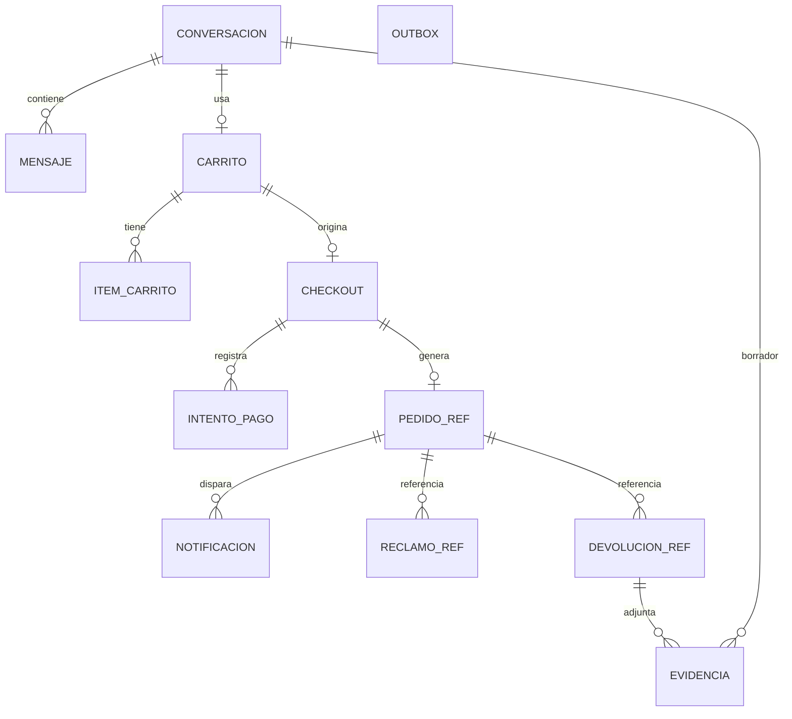

# Modelo de datos — Canal Chatbot

> Documento transversal migrado desde `specs-chatbot/`. Las referencias `SPEC-NN` corresponden a las capacidades de [`openspec/specs/`](../openspec/specs/) (ver el índice en el [README](../README.md#3-índice-de-especificaciones)). Las referencias a secciones numeradas de una spec (por ejemplo, "§4 Requisito 1") remiten a la línea *Trazabilidad* de cada requisito en su `spec.md`.

Base de datos PostgreSQL **propia** del chatbot. No se replican entidades ajenas:

- De usuarios, pedidos, productos y despachos solo se guardan **identificadores** (referencias).
- Se guardan **snapshots** mínimos solo cuando se necesitan para mostrar información o para reintentar una operación.

Convenciones: PK `uuid`, `creado_en` y `actualizado_en` en `timestamptz` (UTC), enumeraciones como `varchar` con `CHECK`, e importes en `numeric(12,2)`.

## Tablas

### `conversacion`
🧩 Ajustada para soportar el modelo de **conversaciones múltiples** de SPEC-05 (barra lateral con "Nuevo chat", "Buscar chats" e "Historial").

| Campo | Tipo | Notas |
|---|---|---|
| id | uuid | PK |
| cliente_id | uuid null | `sub` del token; null si es anónima |
| sid_anonimo | varchar(64) null | Valor de la cookie `chat_sid` (hash) |
| titulo | varchar(40) null | Derivado del primer mensaje del cliente; se genera al llegar ese mensaje. Null mientras la conversación no tiene mensajes (no aparece en el listado). |
| estado | varchar | `ACTIVA`, `ARCHIVADA` (90 días sin actividad), `CERRADA` |
| contexto | jsonb | Estado de trabajo de **esta** conversación: último carrusel mostrado, filtros vigentes, acción pendiente tras el login y borradores (no se comparte entre conversaciones) |
| resumen | text null | Resumen acumulado para acotar el contexto del LLM |
| busqueda | tsvector | Índice generado sobre `titulo` y el texto de los mensajes, para `GET /chat/conversaciones/buscar` |
| ultimo_mensaje_en | timestamptz | Las conversaciones anónimas expiran a los 7 días de inactividad |

### `mensaje`
| Campo | Tipo | Notas |
|---|---|---|
| id | uuid | PK |
| conversacion_id | uuid | FK |
| rol | varchar | `CLIENTE`, `ASISTENTE`, `HERRAMIENTA` |
| texto | text null | **Redactado** si se detecta un dato sensible (tarjeta, contraseña) |
| bloques | jsonb null | Bloques estructurados enviados al frontend |
| herramienta | varchar null | Nombre de la herramienta invocada |
| argumentos | jsonb null | Argumentos validados de la herramienta |
| resultado_codigo | varchar null | `OK` o código de error |
| tokens_entrada / tokens_salida | int null | Métrica de costo del LLM |
| latencia_ms | int null | |
| creado_en | timestamptz | |

### `celular_verificacion_local`
Verificación propia del chatbot (SPEC-04), independiente del perfil de Seguridad. Ver el cambio de diseño en SPEC-04 · Contexto: Seguridad decidió no construir un mecanismo compartido este ciclo (acuerdo A2).

| Campo | Tipo | Notas |
|---|---|---|
| id | uuid | PK |
| cliente_id | uuid | Único junto con `celular` (un registro vigente por cliente y número) |
| celular | varchar(15) | Formato `+51XXXXXXXXX`, el que estaba vigente en `GET /auth/me` al momento de verificar |
| verificado_en | timestamptz | |

### `carrito`
| Campo | Tipo | Notas |
|---|---|---|
| id | uuid | PK |
| cliente_id | uuid null | Único mientras el estado sea `ACTIVO` |
| conversacion_id | uuid null | Para carritos anónimos |
| estado | varchar | `ACTIVO`, `EN_CHECKOUT`, `CONVERTIDO`, `ABANDONADO`, `FUSIONADO` |
| cupon_codigo | varchar null | Cupón aplicado (validado, no consumido) |
| direccion_id | uuid null | Referencia a una dirección en Seguridad |
| envio_snapshot | jsonb null | `{idZona, nombreZona, distrito, costoEnvio, plazoEstimadoDias, cotizadoEn}` |
| totales_snapshot | jsonb null | Último cálculo: subtotal, descuentos, envío y total |
| version | int | Bloqueo optimista |

### `item_carrito`
| Campo | Tipo | Notas |
|---|---|---|
| id | uuid | PK |
| carrito_id | uuid | FK |
| producto_id | varchar | Referencia a Productos |
| sku | varchar | Único por carrito |
| nombre, variante_desc, imagen_url | varchar | Snapshot para mostrar |
| cantidad | int | CHECK 1..10 |
| precio_unitario_ref | numeric | Último precio visto; se recalcula en cada lectura |
| agregado_en | timestamptz | |

### `checkout`
| Campo | Tipo | Notas |
|---|---|---|
| id | uuid | PK |
| carrito_id | uuid | FK |
| cliente_id | uuid | |
| estado | varchar | `PENDIENTE_PAGO`, `PAGO_APROBADO`, `CONFIRMADO`, `FALLIDO`, `EXPIRADO` |
| pedido_id | varchar null | ID en Ventas |
| resumen | jsonb | Snapshot enviado a Ventas: líneas, descuentos, cupón, envío, dirección, `contacto` (incluye `tipoDocumento` y `numeroDocumento`, exigidos por Ventas — ver `contratos-integracion.md` A14) y totales |
| total | numeric | |
| intentos_pago | int | Máximo 3 |
| expira_en | timestamptz | Creación + 15 min |
| idempotency_key | varchar | Único |

### `intento_pago`
| Campo | Tipo | Notas |
|---|---|---|
| id | uuid | PK |
| checkout_id | uuid | FK |
| idempotency_key | varchar | Único |
| resultado | varchar | `APROBADO`, `RECHAZADO`, `ERROR` |
| motivo | varchar null | `FONDOS_INSUFICIENTES`, `DENEGADA_POR_EMISOR`, `ERROR_PROCESAMIENTO`, `DATOS_INVALIDOS` |
| id_transaccion | varchar null | Generado por el simulador (`SIM-...`) |
| marca | varchar | `VISA`, `MASTERCARD`, `AMEX` |
| ultimos4 | char(4) | **Nunca** se guarda el PAN completo, el CVV ni la fecha de vencimiento |
| monto | numeric | |
| creado_en | timestamptz | |

### `pedido_ref`
| Campo | Tipo | Notas |
|---|---|---|
| pedido_id | varchar | PK (ID de Ventas) |
| cliente_id | uuid | |
| checkout_id | uuid | FK |
| estado_local | varchar | `CREADO`, `PAGO_PENDIENTE_NOTIFICAR`, `PAGADO_NOTIFICADO`, `ANULACION_SOLICITADA`, `ANULADO` |
| total | numeric | |
| creado_en | timestamptz | |

### `notificacion`
| Campo | Tipo | Notas |
|---|---|---|
| id | uuid | PK |
| pedido_id | varchar | Único con `tipo` y `numero_reenvio` (idempotencia) |
| tipo | varchar | `CONFIRMACION_PEDIDO`, `REENVIO_CONFIRMACION` |
| numero_reenvio | int | `0` para `CONFIRMACION_PEDIDO`; `1` o `2` para `REENVIO_CONFIRMACION` (máx. 2 por pedido, SPEC-16). Provisional: se revisará al refinar el modelo de datos. |
| destinatario | varchar | Correo |
| estado | varchar | `PENDIENTE`, `ENVIADA`, `FALLIDA` |
| intentos | int | Reintentos de envío SMTP de esta notificación, máximo 3 (no cuenta reenvíos) |
| ultimo_error | text null | |

### `reclamo_ref`
| Campo | Tipo | Notas |
|---|---|---|
| reclamo_id | varchar | PK (ID de Ventas) |
| codigo | varchar | Código visible para el cliente |
| pedido_id | varchar | |
| cliente_id | uuid | |
| idempotency_key | varchar | Único |
| creado_en | timestamptz | |

### `devolucion_ref`
Referencia local de una solicitud de devolución/cambio registrada en Ventas (F3), ver SPEC-21 y SPEC-22.

| Campo | Tipo | Notas |
|---|---|---|
| devolucion_id | varchar | PK (ID de Ventas) |
| codigo | varchar | Código visible para el cliente (p. ej. `DEV-2026-00045`) |
| pedido_id | varchar | |
| cliente_id | uuid | |
| tipo_solicitado | varchar | `CAMBIO`, `DEVOLUCION_DINERO` |
| idempotency_key | varchar | Único |
| evidencia_refs | jsonb | Lista de identificadores de las imágenes subidas (ver `evidencia`) |
| creado_en | timestamptz | |

### `evidencia`
🧩 Simplificada tras el acuerdo A13 (resuelto): Ventas hostea el archivo (`POST /api/v2/devoluciones/evidencias/upload`), así que el chatbot solo guarda la referencia a la URL que Ventas devuelve, no el archivo ni una clave de bucket propio.

| Campo | Tipo | Notas |
|---|---|---|
| id | uuid | PK |
| devolucion_id | varchar null | Null mientras el borrador no se ha enviado |
| conversacion_id | uuid | Para asociar la evidencia al borrador antes de enviarlo |
| tipo | varchar | Tal como lo devuelve Ventas, sin `CHECK` local (hoy `IMAGEN`; valor para PDF pendiente de confirmar con Ventas) |
| url | varchar | La URL que devolvió `POST /api/v2/devoluciones/evidencias/upload`; es la misma que se envía luego en `evidencias[]` al registrar la devolución |
| nombre_archivo_original | varchar | Tal como lo devuelve Ventas |
| tamanio_bytes | int | CHECK ≤ 5 MB |
| creado_en | timestamptz | |

### `outbox`
| Campo | Tipo | Notas |
|---|---|---|
| id | uuid | PK |
| tipo | varchar | `NOTIFICAR_PAGO_VENTAS`, `SOLICITAR_ANULACION`, `ENVIAR_CORREO` |
| payload | jsonb | |
| estado | varchar | `PENDIENTE`, `PROCESADO`, `FALLIDO` |
| intentos | int | Backoff exponencial, máximo 5 |
| proximo_intento_en | timestamptz | |
