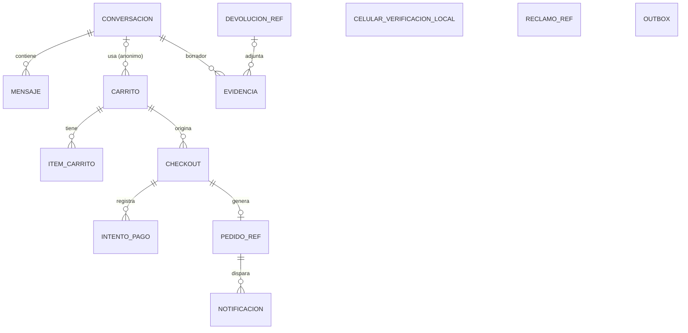

# Modelo de datos — Canal Chatbot

> Documento transversal migrado desde `specs-chatbot/`. Las referencias `SPEC-NN` corresponden a las capacidades de [`openspec/specs/`](../openspec/specs/) (ver el índice en el [README](../README.md#3-índice-de-especificaciones)). Las referencias a secciones numeradas de una spec (por ejemplo, "§4 Requisito 1") remiten a la línea *Trazabilidad* de cada requisito en su `spec.md`.

Base de datos PostgreSQL **propia** del chatbot. No se replican entidades ajenas:

- De usuarios, pedidos, productos y despachos solo se guardan **identificadores** (referencias).
- Se guardan **snapshots** mínimos solo cuando se necesitan para mostrar información o para reintentar una operación.

Diagramas:

- Modelo conceptual (notación Chen): [`diagrams/mer-conceptual.svg`](diagrams/mer-conceptual.svg) · fuente editable [`mer-conceptual.excalidraw`](diagrams/mer-conceptual.excalidraw).
- Modelo lógico (pata de gallo): [`diagrams/mer-logico.svg`](diagrams/mer-logico.svg) · fuente editable [`mer-logico.excalidraw`](diagrams/mer-logico.excalidraw).

## Convenciones

| Tema | Regla |
|---|---|
| Motor | PostgreSQL 18. Acceso desde el backend con SQLAlchemy 2 y migraciones con Alembic (ADR-0001). |
| Claves primarias | `uuid DEFAULT uuidv7()`: UUID ordenado por tiempo, que no fragmenta los índices B-tree como un UUID v4. Excepción: las referencias a agregados de Ventas usan el ID de Ventas como PK (`text`). |
| Referencias externas | `cliente_id` es el `sub` del token (`uuid`); `producto_id`, `pedido_id`, `reclamo_id` y `devolucion_id` son `text` porque el formato lo define el sistema dueño. Nunca tienen FK hacia fuera de esta base (ADR-0013). |
| Texto | `text`. Si hay un límite de negocio se expresa con `CHECK (char_length(col) <= n)`, no con `varchar(n)`. |
| Enumeraciones | `text` con `CHECK (col IN (...))`. No se usan tipos `ENUM` de Postgres porque los estados evolucionan con los specs. |
| Importes | `numeric(12,2)` con `CHECK (col >= 0)`. |
| Tiempos | `timestamptz` (UTC). Toda tabla tiene `creado_en NOT NULL DEFAULT now()`. Las tablas que se modifican tienen además `actualizado_en NOT NULL DEFAULT now()`, mantenido por el trigger `set_actualizado_en()` (no solo por el ORM, para que también se actualice en scripts y correcciones manuales). Las tablas de solo inserción (`mensaje`, `celular_verificacion_local`, `intento_pago`, `reclamo_ref`, `devolucion_ref`) no lo llevan. |
| `jsonb` | Solo para snapshots y datos de forma variable que no se filtran ni se relacionan. Siempre con `CHECK (jsonb_typeof(col) = 'object')`. |
| Claves foráneas | Cada FK declara su `ON DELETE` y tiene un índice sobre la columna que referencia (Postgres no lo crea solo). |
| Idempotencia | Las columnas `idempotency_key` son `text NOT NULL UNIQUE` (ADR-0012). |

Leyenda de las tablas: **Nulo** = `sí` si la columna admite `NULL`.

`RECLAMO_REF` y `DEVOLUCION_REF` guardan `pedido_id` **sin FK** a `pedido_ref`: el cliente elige el pedido desde el listado de Ventas (`GET /api/v1/pedidos?clienteId=`, ver `creacion-reclamo/design.md` y `solicitud-devolucion-cambio/design.md`), y ese pedido puede haberse creado en otro canal, sin fila en `pedido_ref`.

## Tablas

### `conversacion`
🧩 Soporta el modelo de **conversaciones múltiples** de SPEC-05 (barra lateral con "Nuevo chat", "Buscar chats" e "Historial").

| Campo | Tipo | Nulo | Restricciones / notas |
|---|---|---|---|
| id | uuid | no | PK, `DEFAULT uuidv7()` |
| cliente_id | uuid | sí | `sub` del token; null si es anónima |
| sid_anonimo | text | sí | Hash de la cookie `chat_sid` |
| titulo | text | sí | `CHECK (char_length(titulo) <= 40)`. Derivado del primer mensaje del cliente. Null mientras no hay mensajes (no aparece en el listado) |
| estado | text | no | `DEFAULT 'ACTIVA'`, `CHECK IN ('ACTIVA','ARCHIVADA','CERRADA')`. `ARCHIVADA` tras 90 días sin actividad |
| contexto | jsonb | no | `DEFAULT '{}'`. Estado de trabajo de **esta** conversación: último carrusel, filtros vigentes, acción pendiente tras el login y borradores (no se comparte entre conversaciones) |
| resumen | text | sí | Resumen acumulado para acotar el contexto del LLM |
| titulo_busqueda | tsvector | no | `GENERATED ALWAYS AS (to_tsvector('spanish', coalesce(titulo, ''))) STORED` |
| ultimo_mensaje_en | timestamptz | no | `DEFAULT now()`. Las conversaciones anónimas expiran a los 7 días de inactividad |
| creado_en / actualizado_en | timestamptz | no | |

Restricción de tabla: `CHECK (cliente_id IS NOT NULL OR sid_anonimo IS NOT NULL)`, porque toda conversación tiene un dueño, autenticado o anónimo.

| Índice | Consulta que lo usa |
|---|---|
| `(cliente_id, ultimo_mensaje_en DESC) WHERE titulo IS NOT NULL` | Listado paginado de la barra lateral (`GET /chat/conversaciones`) |
| `(sid_anonimo) WHERE cliente_id IS NULL` | Recuperar la conversación anónima y reasignarla al cliente al iniciar sesión |
| `(ultimo_mensaje_en) WHERE cliente_id IS NULL` | Job de expiración de conversaciones anónimas (7 días) |
| `(ultimo_mensaje_en) WHERE estado = 'ACTIVA' AND cliente_id IS NOT NULL` | Job de archivado automático (90 días) |
| GIN `(titulo_busqueda)` | "Buscar chats" por título (`GET /chat/conversaciones/buscar`) |

🧩 Cambio: el `tsvector` sobre "título + texto de todos los mensajes" deja de vivir en `conversacion`. Crecería sin límite y se reescribiría en cada mensaje. La búsqueda combina `titulo_busqueda` con `mensaje.busqueda`.

### `mensaje`
Solo inserción.

| Campo | Tipo | Nulo | Restricciones / notas |
|---|---|---|---|
| id | uuid | no | PK, `DEFAULT uuidv7()` |
| conversacion_id | uuid | no | FK → `conversacion.id` `ON DELETE CASCADE` |
| rol | text | no | `CHECK IN ('CLIENTE','ASISTENTE','HERRAMIENTA')` |
| texto | text | sí | **Redactado** si se detecta un dato sensible (tarjeta, contraseña) |
| bloques | jsonb | sí | Bloques estructurados enviados al frontend |
| herramienta | text | sí | Nombre de la herramienta invocada |
| argumentos | jsonb | sí | Argumentos validados de la herramienta |
| resultado_codigo | text | sí | `OK` o código de error |
| tokens_entrada / tokens_salida | integer | sí | `CHECK (>= 0)`. Métrica de costo del LLM |
| latencia_ms | integer | sí | `CHECK (>= 0)` |
| busqueda | tsvector | no | `GENERATED ALWAYS AS (to_tsvector('spanish', coalesce(texto, ''))) STORED` |
| creado_en | timestamptz | no | |

Restricción de tabla: `CHECK (rol <> 'HERRAMIENTA' OR herramienta IS NOT NULL)`.

| Índice | Consulta que lo usa |
|---|---|
| `(conversacion_id, creado_en DESC)` | Últimos 50 mensajes al reanudar y últimos 12 para el LLM. También cubre la FK |
| GIN `(busqueda)` | "Buscar chats" por contenido de los mensajes |

### `celular_verificacion_local`
Verificación propia del chatbot (SPEC-04), independiente del perfil de Seguridad. Ver el cambio de diseño en SPEC-04 · Contexto: Seguridad decidió no construir un mecanismo compartido este ciclo (acuerdo A2). Solo inserción.

| Campo | Tipo | Nulo | Restricciones / notas |
|---|---|---|---|
| id | uuid | no | PK, `DEFAULT uuidv7()` |
| cliente_id | uuid | no | |
| celular | text | no | `CHECK (celular ~ '^\+51[0-9]{9}$')`. El número vigente en `GET /auth/me` al verificar |
| verificado_en | timestamptz | no | |
| creado_en | timestamptz | no | |

| Índice | Consulta que lo usa |
|---|---|
| `UNIQUE (cliente_id, celular)` | "¿Este cliente ya verificó este número?" antes del checkout |

### `carrito`
| Campo | Tipo | Nulo | Restricciones / notas |
|---|---|---|---|
| id | uuid | no | PK, `DEFAULT uuidv7()` |
| cliente_id | uuid | sí | Null en carritos anónimos |
| conversacion_id | uuid | sí | FK → `conversacion.id` `ON DELETE CASCADE`. Solo en carritos anónimos: al expirar la conversación anónima, se va su carrito |
| estado | text | no | `DEFAULT 'ACTIVO'`, `CHECK IN ('ACTIVO','EN_CHECKOUT','CONVERTIDO','ABANDONADO','FUSIONADO')` |
| cupon_codigo | text | sí | Cupón aplicado (validado, no consumido) |
| direccion_id | uuid | sí | Referencia a una dirección en Seguridad |
| envio_snapshot | jsonb | sí | `{idZona, nombreZona, distrito, costoEnvio, plazoEstimadoDias, cotizadoEn}` |
| totales_snapshot | jsonb | sí | Último cálculo: subtotal, descuentos, envío y total |
| version | integer | no | `DEFAULT 0`. Bloqueo optimista |
| creado_en / actualizado_en | timestamptz | no | |

Restricción de tabla: `CHECK (cliente_id IS NOT NULL OR conversacion_id IS NOT NULL)`.

| Índice | Consulta que lo usa |
|---|---|
| `UNIQUE (cliente_id) WHERE estado IN ('ACTIVO','EN_CHECKOUT')` | Un solo carrito abierto por cliente. Incluye `EN_CHECKOUT` porque, si el checkout falla o expira, el carrito vuelve a `ACTIVO` y no puede chocar con otro |
| `UNIQUE (conversacion_id) WHERE cliente_id IS NULL AND estado IN ('ACTIVO','EN_CHECKOUT')` | Un solo carrito anónimo abierto por conversación. Sirve para la fusión al iniciar sesión |
| `(conversacion_id)` | Cubre la FK (el borrado en cascada de conversaciones anónimas) |
| `(actualizado_en) WHERE cliente_id IS NULL AND estado = 'ACTIVO'` | Job de expiración de carritos anónimos (7 días) |

### `item_carrito`
| Campo | Tipo | Nulo | Restricciones / notas |
|---|---|---|---|
| id | uuid | no | PK, `DEFAULT uuidv7()` |
| carrito_id | uuid | no | FK → `carrito.id` `ON DELETE CASCADE` |
| producto_id | text | no | Referencia a Productos |
| sku | text | no | |
| nombre | text | no | Snapshot para mostrar |
| variante_desc, imagen_url | text | sí | Snapshot para mostrar |
| cantidad | integer | no | `CHECK (cantidad BETWEEN 1 AND 10)` |
| precio_unitario_ref | numeric(12,2) | no | `CHECK (>= 0)`. Último precio visto; se recalcula en cada lectura |
| creado_en / actualizado_en | timestamptz | no | `creado_en` reemplaza a `agregado_en` |

| Índice | Consulta que lo usa |
|---|---|
| `UNIQUE (carrito_id, sku)` | Agregar el mismo SKU suma cantidad en lugar de duplicar la línea. También cubre la FK |

### `checkout`
Un carrito puede originar varios checkouts: si uno expira o falla, el cliente reintenta con el mismo carrito (relación 1:N).

| Campo | Tipo | Nulo | Restricciones / notas |
|---|---|---|---|
| id | uuid | no | PK, `DEFAULT uuidv7()` |
| carrito_id | uuid | no | FK → `carrito.id` `ON DELETE RESTRICT` |
| cliente_id | uuid | no | |
| estado | text | no | `DEFAULT 'PENDIENTE_PAGO'`, `CHECK IN ('PENDIENTE_PAGO','PAGO_APROBADO','CONFIRMADO','FALLIDO','EXPIRADO')` |
| resumen | jsonb | no | Snapshot enviado a Ventas: líneas, descuentos, cupón, envío, dirección, `contacto` (incluye `tipoDocumento` y `numeroDocumento`, exigidos por Ventas — ver `contratos-integracion.md` A14) y totales |
| total | numeric(12,2) | no | `CHECK (>= 0)` |
| intentos_pago | integer | no | `DEFAULT 0`, `CHECK (intentos_pago BETWEEN 0 AND 3)`. Desnormalización deliberada de `count(intento_pago)`: el `CHECK` hace cumplir el máximo de 3 intentos incluso con peticiones concurrentes |
| expira_en | timestamptz | no | Creación + 15 min |
| idempotency_key | text | no | `UNIQUE` |
| creado_en / actualizado_en | timestamptz | no | |

🧩 Cambio: se elimina `checkout.pedido_id`. La relación vive solo en `pedido_ref.checkout_id`, para no tener dos fuentes de verdad.

| Índice | Consulta que lo usa |
|---|---|
| `UNIQUE (carrito_id) WHERE estado IN ('PENDIENTE_PAGO','PAGO_APROBADO')` | Un solo checkout vivo por carrito: evita dos checkouts simultáneos por doble clic o reintentos concurrentes |
| `(carrito_id)` | Cubre la FK e historial de checkouts de un carrito |
| `(expira_en) WHERE estado = 'PENDIENTE_PAGO'` | Job de expiración que corre cada minuto |

### `intento_pago`
Solo inserción.

| Campo | Tipo | Nulo | Restricciones / notas |
|---|---|---|---|
| id | uuid | no | PK, `DEFAULT uuidv7()` |
| checkout_id | uuid | no | FK → `checkout.id` `ON DELETE RESTRICT` |
| idempotency_key | text | no | `UNIQUE` |
| resultado | text | no | `CHECK IN ('APROBADO','RECHAZADO','ERROR')` |
| motivo | text | sí | `CHECK IN ('FONDOS_INSUFICIENTES','DENEGADA_POR_EMISOR','ERROR_PROCESAMIENTO','DATOS_INVALIDOS')` |
| id_transaccion | text | sí | Generado por el simulador (`SIM-...`) |
| marca | text | no | `CHECK IN ('VISA','MASTERCARD','AMEX')` |
| ultimos4 | text | no | `CHECK (ultimos4 ~ '^[0-9]{4}$')`. **Nunca** se guarda el PAN completo, el CVV ni la fecha de vencimiento |
| monto | numeric(12,2) | no | `CHECK (monto > 0)` |
| creado_en | timestamptz | no | |

Restricción de tabla: `CHECK ((resultado = 'APROBADO') = (motivo IS NULL))`, porque un pago aprobado no tiene motivo y uno rechazado o con error siempre lo tiene.

| Índice | Consulta que lo usa |
|---|---|
| `(checkout_id)` | Intentos de un checkout. Cubre la FK |

### `pedido_ref`
| Campo | Tipo | Nulo | Restricciones / notas |
|---|---|---|---|
| pedido_id | text | no | PK (ID de Ventas) |
| cliente_id | uuid | no | |
| checkout_id | uuid | no | FK → `checkout.id` `ON DELETE RESTRICT`, `UNIQUE` (un checkout genera como máximo un pedido) |
| estado_local | text | no | `DEFAULT 'CREADO'`, `CHECK IN ('CREADO','PAGO_PENDIENTE_NOTIFICAR','PAGADO_NOTIFICADO','ANULACION_SOLICITADA','ANULADO')` |
| total | numeric(12,2) | no | `CHECK (>= 0)` |
| creado_en / actualizado_en | timestamptz | no | |

| Índice | Consulta que lo usa |
|---|---|
| PK `(pedido_id)` | Control de pertenencia al consultar seguimiento (junto con `cliente_id`) |
| `UNIQUE (checkout_id)` | Encontrar el pedido de un checkout. Cubre la FK |

### `notificacion`
| Campo | Tipo | Nulo | Restricciones / notas |
|---|---|---|---|
| id | uuid | no | PK, `DEFAULT uuidv7()` |
| pedido_id | text | no | FK → `pedido_ref.pedido_id` `ON DELETE RESTRICT` |
| tipo | text | no | `CHECK IN ('CONFIRMACION_PEDIDO','REENVIO_CONFIRMACION')` |
| numero_reenvio | integer | no | `0` para `CONFIRMACION_PEDIDO`; `1` o `2` para `REENVIO_CONFIRMACION` (máx. 2 por pedido, SPEC-16) |
| destinatario | text | no | Correo |
| estado | text | no | `DEFAULT 'PENDIENTE'`, `CHECK IN ('PENDIENTE','ENVIADA','FALLIDA')` |
| intentos | integer | no | `DEFAULT 0`, `CHECK (intentos BETWEEN 0 AND 3)`. Reintentos SMTP de esta notificación (no cuenta reenvíos) |
| ultimo_error | text | sí | |
| enviada_en | timestamptz | sí | |
| creado_en / actualizado_en | timestamptz | no | |

Restricción de tabla: `CHECK ((tipo = 'CONFIRMACION_PEDIDO' AND numero_reenvio = 0) OR (tipo = 'REENVIO_CONFIRMACION' AND numero_reenvio IN (1, 2)))`.

🧩 Cambio: la clave de idempotencia deja de ser provisional. El `CHECK` anterior ata `numero_reenvio` al `tipo` y hace cumplir el máximo de 2 reenvíos en la base.

| Índice | Consulta que lo usa |
|---|---|
| `UNIQUE (pedido_id, numero_reenvio)` | Idempotencia: el mismo envío no se registra dos veces (`tipo` se deduce de `numero_reenvio`). También cubre la FK |

### `reclamo_ref`
Solo inserción.

| Campo | Tipo | Nulo | Restricciones / notas |
|---|---|---|---|
| reclamo_id | text | no | PK (ID de Ventas) |
| codigo | text | no | `UNIQUE`. Código visible para el cliente |
| pedido_id | text | no | ID de Ventas, **sin FK** (el pedido puede venir de otro canal) |
| cliente_id | uuid | no | |
| idempotency_key | text | no | `UNIQUE` |
| creado_en | timestamptz | no | |

El listado y el detalle de reclamos se consultan a Ventas (SPEC-20); esta tabla sirve para la idempotencia y para asociar el reclamo al cliente. No necesita índices adicionales a las restricciones `UNIQUE`.

### `devolucion_ref`
Referencia local de una solicitud de devolución/cambio registrada en Ventas (F3), ver SPEC-21 y SPEC-22. Solo inserción.

| Campo | Tipo | Nulo | Restricciones / notas |
|---|---|---|---|
| devolucion_id | text | no | PK (ID de Ventas) |
| codigo | text | no | `UNIQUE`. Código visible para el cliente (p. ej. `DEV-2026-0042`; formato definido por Ventas) |
| pedido_id | text | no | ID de Ventas, **sin FK** (el pedido puede venir de otro canal) |
| cliente_id | uuid | no | |
| tipo_solicitado | text | no | `CHECK IN ('CAMBIO','DEVOLUCION_DINERO')` |
| idempotency_key | text | no | `UNIQUE` |
| creado_en | timestamptz | no | |

🧩 Cambio: se elimina `evidencia_refs jsonb`. Duplicaba la relación que ya expresa `evidencia.devolucion_id`; las evidencias de una devolución se obtienen con `WHERE devolucion_id = ?`.

### `evidencia`
🧩 Simplificada tras el acuerdo A13 (resuelto): Ventas hostea el archivo (`POST /api/v2/devoluciones/evidencias/upload`), así que el chatbot solo guarda la referencia a la URL que Ventas devuelve, no el archivo ni una clave de bucket propio. Al enviar la devolución se completa `devolucion_id` (única modificación de la fila).

| Campo | Tipo | Nulo | Restricciones / notas |
|---|---|---|---|
| id | uuid | no | PK, `DEFAULT uuidv7()` |
| devolucion_id | text | sí | FK → `devolucion_ref.devolucion_id` `ON DELETE RESTRICT`. Null mientras el borrador no se ha enviado |
| conversacion_id | uuid | no | FK → `conversacion.id` `ON DELETE CASCADE`. Asocia la evidencia al borrador antes de enviarlo |
| tipo | text | no | Tal como lo devuelve Ventas, sin `CHECK` local (hoy `IMAGEN`; valor para PDF pendiente de confirmar con Ventas) |
| url | text | no | La URL que devolvió `POST /api/v2/devoluciones/evidencias/upload`; es la misma que se envía luego en `evidencias[]` al registrar la devolución |
| nombre_archivo_original | text | no | Tal como lo devuelve Ventas |
| tamanio_bytes | integer | no | `CHECK (tamanio_bytes BETWEEN 1 AND 5242880)` (5 MB) |
| creado_en / actualizado_en | timestamptz | no | |

| Índice | Consulta que lo usa |
|---|---|
| `(conversacion_id, creado_en) WHERE devolucion_id IS NULL` | Evidencias del borrador en curso y limpieza de borradores no enviados (24 h). También cubre la FK para los borradores |
| `(conversacion_id)` | Cubre la FK completa (borrado en cascada) |
| `(devolucion_id)` | Evidencias de una devolución enviada. Cubre la FK |

### `outbox`
Tareas asíncronas con reintento (ADR-0011), procesadas por el worker de APScheduler.

| Campo | Tipo | Nulo | Restricciones / notas |
|---|---|---|---|
| id | uuid | no | PK, `DEFAULT uuidv7()` |
| tipo | text | no | `CHECK IN ('NOTIFICAR_PAGO_VENTAS','SOLICITAR_ANULACION','ENVIAR_CORREO')` |
| payload | jsonb | no | |
| estado | text | no | `DEFAULT 'PENDIENTE'`, `CHECK IN ('PENDIENTE','PROCESADO','FALLIDO')` |
| intentos | integer | no | `DEFAULT 0`, `CHECK (intentos BETWEEN 0 AND 5)`. Backoff exponencial: 5 s, 15 s, 45 s, 2 min, 5 min |
| proximo_intento_en | timestamptz | no | `DEFAULT now()` |
| ultimo_intento_en | timestamptz | sí | 🧩 Nuevo: permite medir el backoff y diagnosticar fallos |
| ultimo_error | text | sí | 🧩 Nuevo |
| procesado_en | timestamptz | sí | 🧩 Nuevo |
| creado_en / actualizado_en | timestamptz | no | |

| Índice | Consulta que lo usa |
|---|---|
| `(proximo_intento_en) WHERE estado = 'PENDIENTE'` | Polling del worker: `WHERE estado = 'PENDIENTE' AND proximo_intento_en <= now() ORDER BY proximo_intento_en FOR UPDATE SKIP LOCKED`. `SKIP LOCKED` permite correr más de un worker sin que tomen la misma tarea |
| `(creado_en DESC) WHERE estado = 'FALLIDO'` | Vista de administración `/admin/outbox-fallidos` |

## Pendientes

- ⚠️ **Retención**: no hay plazo definido para `checkout.resumen` (incluye el documento), `celular_verificacion_local`, `intento_pago`, `notificacion.destinatario` ni `outbox.payload`, ni para borrar conversaciones autenticadas (ver `conversacion/privacidad.md`). Cuando se definan, cada plazo necesitará un job de purga y posiblemente un índice por `creado_en`.
- **Búsqueda full-text a escala**: el índice GIN de `mensaje.busqueda` es global; la consulta filtra después por el `cliente_id` de la conversación. Es suficiente para el volumen del proyecto. Si creciera mucho, se puede desnormalizar `cliente_id` en `mensaje`.
- **Modelo físico**: DDL, trigger `set_actualizado_en()` y migraciones Alembic se escriben en la fase de implementación del backend, a partir de este documento.
