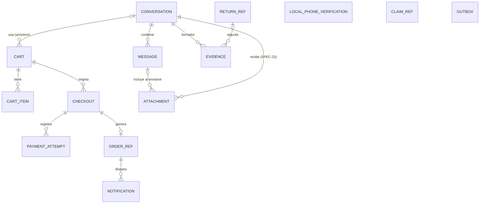

# Modelo de datos — Canal Chatbot

> Documento transversal migrado desde `specs-chatbot/`. Las referencias `SPEC-NN` corresponden a las capacidades de [`openspec/specs/`](../openspec/specs/) (ver el índice en el [README](../README.md#3-índice-de-especificaciones)). Las referencias a secciones numeradas de una spec (por ejemplo, "§4 Requisito 1") remiten a la línea *Trazabilidad* de cada requisito en su `spec.md`.

Base de datos PostgreSQL **propia** del chatbot. No se replican entidades ajenas:

- De usuarios, pedidos, productos y despachos solo se guardan **identificadores** (referencias).
- Se guardan **snapshots** mínimos solo cuando se necesitan para mostrar información o para reintentar una operación.

Diagramas:

- Modelo conceptual (notación Chen): [`diagrams/mer-conceptual.svg`](diagrams/mer-conceptual.svg) · fuente editable [`mer-conceptual.excalidraw`](diagrams/mer-conceptual.excalidraw).
- Modelo lógico (pata de gallo): [`diagrams/mer-logico.svg`](diagrams/mer-logico.svg) · fuente editable [`mer-logico.excalidraw`](diagrams/mer-logico.excalidraw).

## Convenciones

| Tema | Regla |
|---|---|
| Idioma de los identificadores | Todos los identificadores de la base (tablas, columnas, valores de enumeración, constraints e índices) están en inglés. Las etiquetas de la UI están en español y las resuelve el frontend a partir del valor en inglés. Los literales que define un sistema externo (p. ej. Ventas) los traduce el adapter en el límite, en ambos sentidos. |
| Motor | PostgreSQL 18. Acceso desde el backend con SQLAlchemy 2 y migraciones con Alembic (ADR-0001). |
| Claves primarias | `uuid DEFAULT uuidv7()`: UUID ordenado por tiempo, que no fragmenta los índices B-tree como un UUID v4. Excepción: las referencias a agregados de Ventas usan el ID de Ventas como PK (`text`). |
| Referencias externas | `customer_id` es el `sub` del token (`uuid`); `product_id`, `order_id`, `claim_id` y `return_id` son `text` porque el formato lo define el sistema dueño. Nunca tienen FK hacia fuera de esta base (ADR-0013). |
| Texto | `text`. Si hay un límite de negocio se expresa con `CHECK (char_length(col) <= n)`, no con `varchar(n)`. |
| Enumeraciones | `text` con `CHECK (col IN (...))`. No se usan tipos `ENUM` de Postgres porque los estados evolucionan con los specs. |
| Importes | `numeric(12,2)` con `CHECK (col >= 0)`. |
| Tiempos | `timestamptz` (UTC). Toda tabla tiene `created_at NOT NULL DEFAULT now()`. Las tablas que se modifican tienen además `updated_at NOT NULL DEFAULT now()`, mantenido por el trigger `set_updated_at()` (no solo por el ORM, para que también se actualice en scripts y correcciones manuales). Las tablas de solo inserción (`message`, `local_phone_verification`, `payment_attempt`, `claim_ref`, `return_ref`) no lo llevan. |
| `jsonb` | Solo para snapshots y datos de forma variable que no se filtran ni se relacionan. Siempre con `CHECK (jsonb_typeof(col) = 'object')`. |
| Snapshots de módulos externos | Cuando se guarda una copia del contrato de un módulo ajeno, se conserva el nombre real del campo externo (`product_id`, `precio_regular`, `channel_id`, etc.) en el `jsonb`, tal como lo define el otro sistema, y no se renombra a la convención de esta base (por eso `product_id` dentro de un `jsonb` es el campo externo, distinto de la columna `cart_item.product_id`); solo se agrega una capa local si sí hace falta para la lógica del canal. |
| Claves foráneas | Cada FK declara su `ON DELETE` y tiene un índice sobre la columna que referencia (Postgres no lo crea solo). |
| Idempotencia | Las columnas `idempotency_key` son `text NOT NULL UNIQUE` (ADR-0012). |

Leyenda de las tablas: **Nulo** = `sí` si la columna admite `NULL`.

```mermaid
erDiagram
    CONVERSATION ||--o{ MESSAGE : contiene
    CONVERSATION |o--o{ CART : "usa (anonimo)"
    CART ||--o{ CART_ITEM : tiene
    CART ||--o{ CHECKOUT : origina
    CHECKOUT ||--o{ PAYMENT_ATTEMPT : registra
    CHECKOUT ||--o| ORDER_REF : genera
    ORDER_REF ||--o{ NOTIFICATION : dispara
    RETURN_REF |o--o{ EVIDENCE : adjunta
    CONVERSATION ||--o{ EVIDENCE : borrador
    CONVERSATION ||--o{ ATTACHMENT : "recibe (SPEC-23)"
    MESSAGE |o--o{ ATTACHMENT : "incluye al enviarse"
    LOCAL_PHONE_VERIFICATION
    CLAIM_REF
    OUTBOX
```

`CLAIM_REF` y `RETURN_REF` guardan `order_id` **sin FK** a `order_ref`: el cliente elige el pedido desde el listado de Ventas (`GET /api/v1/pedidos?clienteId=`, ver `creacion-reclamo/design.md` y `solicitud-devolucion-cambio/design.md`), y ese pedido puede haberse creado en otro canal, sin fila en `order_ref`.

## Tablas

### `conversation`
🧩 Soporta el modelo de **conversaciones múltiples** de SPEC-05 (barra lateral con "Nuevo chat", "Buscar chats" e "Historial").

| Campo | Tipo | Nulo | Restricciones / notas |
|---|---|---|---|
| id | uuid | no | PK, `DEFAULT uuidv7()` |
| customer_id | uuid | sí | `sub` del token; null si es anónima |
| anonymous_sid | text | sí | Hash de la cookie `chat_sid` |
| title | text | sí | `CHECK (char_length(title) <= 40)`. Derivado del primer mensaje del cliente. Null mientras no hay mensajes (no aparece en el listado) |
| status | text | no | `DEFAULT 'ACTIVE'`, `CHECK IN ('ACTIVE','ARCHIVED','CLOSED')`. `ARCHIVED` tras 90 días sin actividad |
| context | jsonb | no | `DEFAULT '{}'`. Estado de trabajo de **esta** conversación: último carrusel, filtros vigentes, acción pendiente tras el login y borradores (no se comparte entre conversaciones) |
| summary | text | sí | Resumen acumulado para acotar el contexto del LLM |
| title_search_vector | tsvector | no | `GENERATED ALWAYS AS (to_tsvector('spanish', coalesce(title, ''))) STORED` |
| last_message_at | timestamptz | no | `DEFAULT now()`. Las conversaciones anónimas expiran a los 7 días de inactividad |
| created_at / updated_at | timestamptz | no | |

Restricción de tabla: `CHECK (customer_id IS NOT NULL OR anonymous_sid IS NOT NULL)`, porque toda conversación tiene un dueño, autenticado o anónimo.

| Índice | Consulta que lo usa |
|---|---|
| `(customer_id, last_message_at DESC) WHERE title IS NOT NULL` | Listado paginado de la barra lateral (`GET /chat/conversaciones`) |
| `(anonymous_sid) WHERE customer_id IS NULL` | Recuperar la conversación anónima y reasignarla al cliente al iniciar sesión |
| `(last_message_at) WHERE customer_id IS NULL` | Job de expiración de conversaciones anónimas (7 días) |
| `(last_message_at) WHERE status = 'ACTIVE' AND customer_id IS NOT NULL` | Job de archivado automático (90 días) |
| GIN `(title_search_vector)` | "Buscar chats" por título (`GET /chat/conversaciones/buscar`) |

🧩 Cambio: el `tsvector` sobre "título + texto de todos los mensajes" deja de vivir en `conversation`. Crecería sin límite y se reescribiría en cada mensaje. La búsqueda combina `title_search_vector` con `message.search_vector`.

### `message`
Solo inserción.

| Campo | Tipo | Nulo | Restricciones / notas |
|---|---|---|---|
| id | uuid | no | PK, `DEFAULT uuidv7()` |
| conversation_id | uuid | no | FK → `conversation.id` `ON DELETE CASCADE` |
| role | text | no | `CHECK IN ('CUSTOMER','ASSISTANT','TOOL')` |
| content | text | sí | **Redactado** si se detecta un dato sensible (tarjeta, contraseña) |
| blocks | jsonb | sí | Bloques estructurados enviados al frontend |
| tool_name | text | sí | Nombre de la herramienta invocada |
| arguments | jsonb | sí | Argumentos validados de la herramienta |
| result_code | text | sí | `OK` o código de error |
| input_tokens / output_tokens | integer | sí | `CHECK (>= 0)`. Métrica de costo del LLM |
| latency_ms | integer | sí | `CHECK (>= 0)` |
| search_vector | tsvector | no | `GENERATED ALWAYS AS (to_tsvector('spanish', coalesce(content, ''))) STORED` |
| created_at | timestamptz | no | |

Restricción de tabla: `CHECK (role <> 'TOOL' OR tool_name IS NOT NULL)`.

| Índice | Consulta que lo usa |
|---|---|
| `(conversation_id, created_at DESC)` | Últimos 50 mensajes al reanudar y últimos 12 para el LLM. También cubre la FK |
| GIN `(search_vector)` | "Buscar chats" por contenido de los mensajes |

### `local_phone_verification`
Verificación propia del chatbot (SPEC-04), independiente del perfil de Seguridad. Ver el cambio de diseño en SPEC-04 · Contexto: Seguridad decidió no construir un mecanismo compartido este ciclo (acuerdo A2). Solo inserción.

| Campo | Tipo | Nulo | Restricciones / notas |
|---|---|---|---|
| id | uuid | no | PK, `DEFAULT uuidv7()` |
| customer_id | uuid | no | |
| phone | text | no | `CHECK (phone ~ '^\+51[0-9]{9}$')`. El número vigente en `GET /auth/me` al verificar |
| verified_at | timestamptz | no | |
| created_at | timestamptz | no | |

| Índice | Consulta que lo usa |
|---|---|
| `UNIQUE (customer_id, phone)` | "¿Este cliente ya verificó este número?" antes del checkout |

### `cart`
| Campo | Tipo | Nulo | Restricciones / notas |
|---|---|---|---|
| id | uuid | no | PK, `DEFAULT uuidv7()` |
| customer_id | uuid | sí | Null en carritos anónimos |
| conversation_id | uuid | sí | FK → `conversation.id` `ON DELETE CASCADE`. Solo en carritos anónimos: al expirar la conversación anónima, se va su carrito |
| status | text | no | `DEFAULT 'ACTIVE'`, `CHECK IN ('ACTIVE','IN_CHECKOUT','CONVERTED','ABANDONED','MERGED')` |
| coupon_code | text | sí | Cupón aplicado (validado, no consumido) |
| address_id | uuid | sí | Referencia a una dirección en Seguridad |
| shipping_snapshot | jsonb | sí | `{idZona, nombreZona, distrito, costoEnvio, plazoEstimadoDias, cotizadoEn}` |
| totals_snapshot | jsonb | sí | Último cálculo: subtotal, descuentos, envío y total |
| version | integer | no | `DEFAULT 0`. Bloqueo optimista |
| created_at / updated_at | timestamptz | no | |

Restricción de tabla: `CHECK (customer_id IS NOT NULL OR conversation_id IS NOT NULL)`.

| Índice | Consulta que lo usa |
|---|---|
| `UNIQUE (customer_id) WHERE status IN ('ACTIVE','IN_CHECKOUT')` | Un solo carrito abierto por cliente. Incluye `IN_CHECKOUT` porque, si el checkout falla o expira, el carrito vuelve a `ACTIVE` y no puede chocar con otro |
| `UNIQUE (conversation_id) WHERE customer_id IS NULL AND status IN ('ACTIVE','IN_CHECKOUT')` | Un solo carrito anónimo abierto por conversación. Sirve para la fusión al iniciar sesión |
| `(conversation_id)` | Cubre la FK (el borrado en cascada de conversaciones anónimas) |
| `(updated_at) WHERE customer_id IS NULL AND status = 'ACTIVE'` | Job de expiración de carritos anónimos (7 días) |

### `cart_item`
| Campo | Tipo | Nulo | Restricciones / notas |
|---|---|---|---|
| id | uuid | no | PK, `DEFAULT uuidv7()` |
| cart_id | uuid | no | FK → `cart.id` `ON DELETE CASCADE` |
| product_id | text | no | Referencia a Productos |
| sku | text | no | |
| name | text | no | Snapshot para mostrar |
| variant_description, image_url | text | sí | Snapshot para mostrar |
| quantity | integer | no | `CHECK (quantity BETWEEN 1 AND 10)` |
| unit_price_ref | numeric(12,2) | no | `CHECK (>= 0)`. Último precio visto; se recalcula en cada lectura |
| created_at / updated_at | timestamptz | no | `created_at` reemplaza a `added_at` |

| Índice | Consulta que lo usa |
|---|---|
| `UNIQUE (cart_id, sku)` | Agregar el mismo SKU suma cantidad en lugar de duplicar la línea. También cubre la FK |

### `checkout`
Un carrito puede originar varios checkouts: si uno expira o falla, el cliente reintenta con el mismo carrito (relación 1:N).

| Campo | Tipo | Nulo | Restricciones / notas |
|---|---|---|---|
| id | uuid | no | PK, `DEFAULT uuidv7()` |
| cart_id | uuid | no | FK → `cart.id` `ON DELETE RESTRICT` |
| customer_id | uuid | no | |
| status | text | no | `DEFAULT 'PENDING_PAYMENT'`, `CHECK IN ('PENDING_PAYMENT','PAYMENT_APPROVED','CONFIRMED','FAILED','EXPIRED')` |
| summary | jsonb | no | Snapshot enviado a Ventas: líneas, descuentos, cupón, envío, dirección, `contacto` (incluye `tipoDocumento` y `numeroDocumento`, exigidos por Ventas — ver `contratos-integracion.md` A14) y totales |
| total | numeric(12,2) | no | `CHECK (>= 0)` |
| payment_attempts | integer | no | `DEFAULT 0`, `CHECK (payment_attempts BETWEEN 0 AND 3)`. Desnormalización deliberada de `count(payment_attempt)`: el `CHECK` hace cumplir el máximo de 3 intentos incluso con peticiones concurrentes |
| expires_at | timestamptz | no | Creación + 15 min |
| idempotency_key | text | no | `UNIQUE` |
| created_at / updated_at | timestamptz | no | |

🧩 Cambio: se elimina `checkout.order_id`. La relación vive solo en `order_ref.checkout_id`, para no tener dos fuentes de verdad.

| Índice | Consulta que lo usa |
|---|---|
| `UNIQUE (cart_id) WHERE status IN ('PENDING_PAYMENT','PAYMENT_APPROVED')` | Un solo checkout vivo por carrito: evita dos checkouts simultáneos por doble clic o reintentos concurrentes |
| `(cart_id)` | Cubre la FK e historial de checkouts de un carrito |
| `(expires_at) WHERE status = 'PENDING_PAYMENT'` | Job de expiración que corre cada minuto |

### `payment_attempt`
Solo inserción.

| Campo | Tipo | Nulo | Restricciones / notas |
|---|---|---|---|
| id | uuid | no | PK, `DEFAULT uuidv7()` |
| checkout_id | uuid | no | FK → `checkout.id` `ON DELETE RESTRICT` |
| idempotency_key | text | no | `UNIQUE` |
| result | text | no | `CHECK IN ('APPROVED','REJECTED','ERROR')` |
| reason | text | sí | `CHECK IN ('INSUFFICIENT_FUNDS','DECLINED_BY_ISSUER','PROCESSING_ERROR','INVALID_DATA')` |
| transaction_id | text | sí | Generado por el simulador (`SIM-...`) |
| brand | text | no | `CHECK IN ('VISA','MASTERCARD','AMEX')` |
| last4 | text | no | `CHECK (last4 ~ '^[0-9]{4}$')`. **Nunca** se guarda el PAN completo, el CVV ni la fecha de vencimiento |
| amount | numeric(12,2) | no | `CHECK (amount > 0)` |
| created_at | timestamptz | no | |

Restricción de tabla: `CHECK ((result = 'APPROVED') = (reason IS NULL))`, porque un pago aprobado no tiene motivo y uno rechazado o con error siempre lo tiene.

| Índice | Consulta que lo usa |
|---|---|
| `(checkout_id)` | Intentos de un checkout. Cubre la FK |

### `order_ref`
| Campo | Tipo | Nulo | Restricciones / notas |
|---|---|---|---|
| order_id | text | no | PK (ID de Ventas) |
| customer_id | uuid | no | |
| checkout_id | uuid | no | FK → `checkout.id` `ON DELETE RESTRICT`, `UNIQUE` (un checkout genera como máximo un pedido) |
| local_status | text | no | `DEFAULT 'CREATED'`, `CHECK IN ('CREATED','PAYMENT_PENDING_NOTIFICATION','PAID_NOTIFIED','CANCELLATION_REQUESTED','CANCELLED')` |
| total | numeric(12,2) | no | `CHECK (>= 0)` |
| created_at / updated_at | timestamptz | no | |

| Índice | Consulta que lo usa |
|---|---|
| PK `(order_id)` | Control de pertenencia al consultar seguimiento (junto con `customer_id`) |
| `UNIQUE (checkout_id)` | Encontrar el pedido de un checkout. Cubre la FK |

### `notification`
| Campo | Tipo | Nulo | Restricciones / notas |
|---|---|---|---|
| id | uuid | no | PK, `DEFAULT uuidv7()` |
| order_id | text | no | FK → `order_ref.order_id` `ON DELETE RESTRICT` |
| type | text | no | `CHECK IN ('ORDER_CONFIRMATION','CONFIRMATION_RESEND')` |
| resend_number | integer | no | `0` para `ORDER_CONFIRMATION`; `1` o `2` para `CONFIRMATION_RESEND` (máx. 2 por pedido, SPEC-16) |
| recipient | text | no | Correo |
| status | text | no | `DEFAULT 'PENDING'`, `CHECK IN ('PENDING','SENT','FAILED')` |
| attempts | integer | no | `DEFAULT 0`, `CHECK (attempts BETWEEN 0 AND 3)`. Reintentos SMTP de esta notificación (no cuenta reenvíos) |
| last_error | text | sí | |
| sent_at | timestamptz | sí | |
| created_at / updated_at | timestamptz | no | |

Restricción de tabla: `CHECK ((type = 'ORDER_CONFIRMATION' AND resend_number = 0) OR (type = 'CONFIRMATION_RESEND' AND resend_number IN (1, 2)))`.

🧩 Cambio: la clave de idempotencia deja de ser provisional. El `CHECK` anterior ata `resend_number` al `type` y hace cumplir el máximo de 2 reenvíos en la base.

| Índice | Consulta que lo usa |
|---|---|
| `UNIQUE (order_id, resend_number)` | Idempotencia: el mismo envío no se registra dos veces (`type` se deduce de `resend_number`). También cubre la FK |

### `claim_ref`
Solo inserción.

| Campo | Tipo | Nulo | Restricciones / notas |
|---|---|---|---|
| claim_id | text | no | PK (ID de Ventas) |
| code | text | no | `UNIQUE`. Código visible para el cliente |
| order_id | text | no | ID de Ventas, **sin FK** (el pedido puede venir de otro canal) |
| customer_id | uuid | no | |
| idempotency_key | text | no | `UNIQUE` |
| created_at | timestamptz | no | |

El listado y el detalle de reclamos se consultan a Ventas (SPEC-20); esta tabla sirve para la idempotencia y para asociar el reclamo al cliente. No necesita índices adicionales a las restricciones `UNIQUE`.

### `return_ref`
Referencia local de una solicitud de devolución/cambio registrada en Ventas (F3), ver SPEC-21 y SPEC-22. Solo inserción.

| Campo | Tipo | Nulo | Restricciones / notas |
|---|---|---|---|
| return_id | text | no | PK (ID de Ventas) |
| code | text | no | `UNIQUE`. Código visible para el cliente (p. ej. `DEV-2026-0042`; formato definido por Ventas) |
| order_id | text | no | ID de Ventas, **sin FK** (el pedido puede venir de otro canal) |
| customer_id | uuid | no | |
| requested_type | text | no | `CHECK IN ('EXCHANGE','MONEY_REFUND')`. La base guarda el valor en inglés; el adapter lo traduce en ambos sentidos al literal del contrato con Ventas (`EXCHANGE` ↔ `CAMBIO`, `MONEY_REFUND` ↔ `DEVOLUCION_DINERO`), tanto en las respuestas que recibe como en las solicitudes que envía |
| idempotency_key | text | no | `UNIQUE` |
| created_at | timestamptz | no | |

🧩 Cambio: se elimina `evidence_refs jsonb`. Duplicaba la relación que ya expresa `evidence.return_id`; las evidencias de una devolución se obtienen con `WHERE return_id = ?`.

### `evidence`
🧩 Simplificada tras el acuerdo A13 (resuelto): Ventas hostea el archivo (`POST /api/v2/devoluciones/evidencias/upload`), así que el chatbot solo guarda la referencia a la URL que Ventas devuelve, no el archivo ni una clave de bucket propio. Al enviar la devolución se completa `return_id` (única modificación de la fila).

| Campo | Tipo | Nulo | Restricciones / notas |
|---|---|---|---|
| id | uuid | no | PK, `DEFAULT uuidv7()` |
| return_id | text | sí | FK → `return_ref.return_id` `ON DELETE RESTRICT`. Null mientras el borrador no se ha enviado |
| conversation_id | uuid | no | FK → `conversation.id` `ON DELETE CASCADE`. Asocia la evidencia al borrador antes de enviarlo |
| type | text | no | Sin `CHECK` local (hoy `IMAGE`; valor para PDF pendiente de confirmar con Ventas). La base guarda el valor en inglés; el adapter lo traduce en ambos sentidos al literal que usa Ventas (`IMAGE` ↔ `IMAGEN`), tanto en las respuestas que recibe como en las solicitudes que envía |
| url | text | no | La URL que devolvió `POST /api/v2/devoluciones/evidencias/upload`; es la misma que se envía luego en `evidencias[]` al registrar la devolución |
| original_file_name | text | no | Tal como lo devuelve Ventas |
| size_bytes | integer | no | `CHECK (size_bytes BETWEEN 1 AND 5242880)` (5 MB) |
| created_at / updated_at | timestamptz | no | |

| Índice | Consulta que lo usa |
|---|---|
| `(conversation_id, created_at) WHERE return_id IS NULL` | Evidencias del borrador en curso y limpieza de borradores no enviados (24 h). También cubre la FK para los borradores |
| `(conversation_id)` | Cubre la FK completa (borrado en cascada) |
| `(return_id)` | Evidencias de una devolución enviada. Cubre la FK |

### `attachment`
🧩 Nueva tabla (SPEC-23, ADR-0019). Referencia a una imagen que el cliente adjunta a un mensaje del chat para que el LLM la interprete. La base guarda solo **referencias**: los bytes viven en un bucket privado de Supabase Storage (puerto `AttachmentStorage`). No es la evidencia de devolución (`evidence`), que aloja Ventas. Se crea al subir la imagen (estado `PENDING`, sin mensaje) y se liga a un único mensaje al enviarlo (estado `SENT`); son las únicas modificaciones de la fila.

| Campo | Tipo | Nulo | Restricciones / notas |
|---|---|---|---|
| id | uuid | no | PK, `DEFAULT uuidv7()`. Es el `adjuntoId` de la API |
| conversation_id | uuid | no | FK → `conversation.id` `ON DELETE CASCADE`. Define la pertenencia por `customer_id` o `chat_sid` de la conversación, también para visitantes anónimos |
| message_id | uuid | sí | FK → `message.id` `ON DELETE CASCADE`. Null mientras el estado es `PENDING` |
| status | text | no | `DEFAULT 'PENDING'`, `CHECK IN ('PENDING','SENT')` |
| storage_key | text | no | `UNIQUE`. Clave aleatoria del objeto de la imagen normalizada en el bucket privado; no deriva del nombre original |
| thumbnail_key | text | no | `UNIQUE`. Clave del objeto de la miniatura |
| mime_type | text | no | `CHECK IN ('image/jpeg','image/png','image/webp')`. Detectado por firma binaria |
| size_bytes | integer | no | `CHECK (size_bytes BETWEEN 1 AND 5242880)` (5 MB). Tamaño de la imagen guardada |
| width / height | integer | no | `CHECK (> 0)`. Dimensiones guardadas en píxeles (lado mayor máx. 2048 px, valor provisional) |
| created_at / updated_at | timestamptz | no | `created_at` es la fecha de carga y la usa el job de limpieza |

Restricción de tabla: `CHECK ((status = 'SENT') = (message_id IS NOT NULL))`, porque un adjunto enviado siempre está ligado a un mensaje y uno pendiente nunca. El nombre original del archivo no se guarda. Como `message` es de solo inserción, el ligado se hace desde `attachment` (nunca se modifica el mensaje). El límite de 3 adjuntos por mensaje se valida en `AdjuntoService` (SPEC-23 · Requisito 4).

| Índice | Consulta que lo usa |
|---|---|
| `(message_id) WHERE message_id IS NOT NULL` | Adjuntos de un mensaje al armar el historial (`GET /chat/conversaciones/{id}/mensajes`) y las imágenes del contexto del LLM. Cubre la FK |
| `(conversation_id, status)` | Conteo de adjuntos `PENDING` de la conversación para el tope de 10 y pertenencia al emitir URLs firmadas. Cubre la FK |
| `(created_at) WHERE status = 'PENDING'` | Job de limpieza de adjuntos no enviados a las 24 h |
| `UNIQUE (storage_key)`, `UNIQUE (thumbnail_key)` | Evitar que dos filas apunten al mismo objeto y ubicar la fila al reconciliar archivos huérfanos del bucket |

### `outbox`
Tareas asíncronas con reintento (ADR-0011), procesadas por el worker de APScheduler.

| Campo | Tipo | Nulo | Restricciones / notas |
|---|---|---|---|
| id | uuid | no | PK, `DEFAULT uuidv7()` |
| type | text | no | `CHECK IN ('NOTIFY_SALES_PAYMENT','REQUEST_CANCELLATION','SEND_EMAIL')` |
| payload | jsonb | no | |
| status | text | no | `DEFAULT 'PENDING'`, `CHECK IN ('PENDING','PROCESSED','FAILED')` |
| attempts | integer | no | `DEFAULT 0`, `CHECK (attempts BETWEEN 0 AND 5)`. Backoff exponencial: 5 s, 15 s, 45 s, 2 min, 5 min |
| next_attempt_at | timestamptz | no | `DEFAULT now()` |
| last_attempt_at | timestamptz | sí | 🧩 Nuevo: permite medir el backoff y diagnosticar fallos |
| last_error | text | sí | 🧩 Nuevo |
| processed_at | timestamptz | sí | 🧩 Nuevo |
| created_at / updated_at | timestamptz | no | |

| Índice | Consulta que lo usa |
|---|---|
| `(next_attempt_at) WHERE status = 'PENDING'` | Polling del worker: `WHERE status = 'PENDING' AND next_attempt_at <= now() ORDER BY next_attempt_at FOR UPDATE SKIP LOCKED`. `SKIP LOCKED` permite correr más de un worker sin que tomen la misma tarea |
| `(created_at DESC) WHERE status = 'FAILED'` | Vista de administración `/admin/outbox-fallidos` |

## Pendientes

- ⚠️ **Retención**: no hay plazo definido para `checkout.summary` (incluye el documento), `local_phone_verification`, `payment_attempt`, `notification.recipient` ni `outbox.payload`, ni para borrar conversaciones autenticadas (ver `conversacion/privacidad.md`). Cuando se definan, cada plazo necesitará un job de purga y posiblemente un índice por `created_at`.
- ⚠️ **Retención de adjuntos del chat** (SPEC-23): no hay plazo definido para `attachment` ni para los archivos del bucket (solo se limpian los pendientes a las 24 h). Falta decidir si se alinea con el archivado de 90 días y qué ocurre con las imágenes de conversaciones anónimas al expirar; el borrado de archivos requiere un job que reconcilie el bucket con la tabla.
- ⚠️ **PostgreSQL 18 en Supabase**: las claves usan `uuidv7()` nativo de PostgreSQL 18 y no está confirmado que el plan gratuito de Supabase lo ofrezca. Si no, habrá que generar el UUID v7 en la aplicación o con una función propia; no se cambia el modelo por ahora.
- **Búsqueda full-text a escala**: el índice GIN de `message.search_vector` es global; la consulta filtra después por el `customer_id` de la conversación. Es suficiente para el volumen del proyecto. Si creciera mucho, se puede desnormalizar `customer_id` en `message`.
- **Modelo físico**: DDL, trigger `set_updated_at()` y migraciones Alembic se escriben en la fase de implementación del backend, a partir de este documento.
