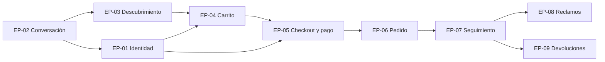

# Épicas — Canal Chatbot

> Capa de producto sobre las 22 specs de `openspec/specs/`. Las épicas se derivan del campo **Grupo** del índice del [README](../../README.md#3-índice-de-especificaciones). Dos grupos se dividieron para que cada épica quede de un tamaño manejable y con un objetivo único:
>
> - **Checkout** (SPEC-12 a 16) → EP-05 *Checkout y pago* (SPEC-12, 13, 14) y EP-06 *Grabación y confirmación del pedido* (SPEC-15, 16).
> - **Postventa** (SPEC-19 a 22) → EP-08 *Reclamos* (SPEC-19, 20) y EP-09 *Devoluciones y reembolsos* (SPEC-21, 22).
>
> El **Hito** de cada spec sale del "Orden sugerido de implementación" del README.

## Resumen

| Épica | Nombre | Grupo (README) | Specs | Área | Hito | Historias | Puntos |
|---|---|---|---|---|---|---|---|
| EP-01 | Identidad y sesión | Identidad | SPEC-01, 02, 03, 04 | `IDE` | Hito 3 (01–03) · Hito 4 (04) | 14 | 50 |
| EP-02 | Motor de conversación | Transversal | SPEC-05 | `CNV` | Hito 3 | 12 | 57 |
| EP-03 | Descubrimiento de productos | Descubrimiento | SPEC-06, 07, 08, 09 | `CAT` | Hito 3 (06, 09) · Hito 4 (07, 08) | 16 | 61 |
| EP-04 | Carrito y stock | Carrito | SPEC-10, 11 | `CAR` | Hito 3 | 8 | 36 |
| EP-05 | Checkout y pago | Checkout | SPEC-12, 13, 14 | `CHK` | Hito 4 | 16 | 65 |
| EP-06 | Grabación y confirmación del pedido | Checkout | SPEC-15, 16 | `PED` | Hito 4 | 8 | 32 |
| EP-07 | Seguimiento de pedidos | Seguimiento | SPEC-17, 18 | `SGT` | Hito 5–6 | 8 | 28 |
| EP-08 | Reclamos | Postventa | SPEC-19, 20 | `RCL` | Hito 5–6 | 7 | 22 |
| EP-09 | Devoluciones y reembolsos | Postventa | SPEC-21, 22 | `DEV` | Hito 5–6 | 9 | 31 |
| | **Total** | | **22 specs** | | | **98** | **382** |

---

## EP-01 · Identidad y sesión

- **Objetivo:** que el cliente cree su cuenta, verifique su correo, inicie sesión (con MFA si corresponde), mantenga la sesión viva y valide su celular antes de pagar, sin salir del chat.
- **Valor de negocio:** habilita todas las acciones protegidas (pago, pedidos, postventa) y cubre el lineamiento "validación del número celular y correo del cliente". Sin esta épica no hay compra.
- **Specs:** SPEC-01 Registro · SPEC-02 Verificación de correo · SPEC-03 Inicio de sesión, MFA y sesión · SPEC-04 Validación local de celular.
- **Hito:** Hito 3 (SPEC-01 a 03) y Hito 4 (SPEC-04).
- **Dependencias:** EP-02 (herramientas y acción pendiente); EP-04 para la fusión de carritos; Seguridad ✅ (todos los endpoints confirmados; A1 resuelto con una acción pendiente; A2 decidido fuera de alcance de Seguridad).
- **Historias:** [historias/EP-01-identidad-sesion.md](historias/EP-01-identidad-sesion.md)

## EP-02 · Motor de conversación

- **Objetivo:** ofrecer la aplicación de chat de pantalla completa (conversaciones múltiples, pantalla de inicio, streaming) e interpretar cada mensaje con herramientas de forma segura y verídica.
- **Valor de negocio:** es la base transversal que usan las demás specs y cubre el lineamiento "consulta conversacional de productos mediante lenguaje natural".
- **Specs:** SPEC-05.
- **Hito:** Hito 3.
- **Dependencias:** proveedor LLM (configuración); SPEC-03 para ligar conversaciones al cliente; SPEC-08 para el grid de ofertas del inicio (ver [preguntas abiertas](alcance.md#preguntas-abiertas)).
- **Historias:** [historias/EP-02-conversacion.md](historias/EP-02-conversacion.md)

## EP-03 · Descubrimiento de productos

- **Objetivo:** que el cliente encuentre productos por búsqueda, recomendación u ofertas, y los vea como tarjetas con detalle y variantes.
- **Valor de negocio:** cubre los lineamientos de búsqueda por características, recomendación según necesidad y consulta de ofertas; es el embudo de entrada a la venta.
- **Specs:** SPEC-06 Búsqueda · SPEC-07 Recomendación · SPEC-08 Ofertas · SPEC-09 Tarjetas y detalle.
- **Hito:** Hito 3 (SPEC-06, 09) y Hito 4 (SPEC-07, 08).
- **Dependencias:** EP-02; Productos 🟡 (A5, A7): **todas** las rutas son provisionales y se desarrollan contra mock.
- **Historias:** [historias/EP-03-descubrimiento.md](historias/EP-03-descubrimiento.md)

## EP-04 · Carrito y stock

- **Objetivo:** que el cliente arme su carrito por conversación o botones, con stock validado y totales siempre recalculados.
- **Valor de negocio:** cubre el lineamiento "agregar productos al carrito mediante conversación" y evita vender lo que no hay.
- **Specs:** SPEC-10 Validación de stock · SPEC-11 Gestión del carrito.
- **Hito:** Hito 3 (la revalidación masiva se prueba de punta a punta con el checkout de Hito 4).
- **Dependencias:** EP-03 (tarjetas y variantes); EP-01 (fusión al iniciar sesión); Productos 🟡 (A5: disponibilidad, precios y evaluación).
- **Historias:** [historias/EP-04-carrito.md](historias/EP-04-carrito.md)

## EP-05 · Checkout y pago

- **Objetivo:** llevar al cliente del carrito a un pago aprobado: documento, dirección, cotización de envío, cupón, resumen fiel, introspección de sesión y pago simulado con tarjeta.
- **Valor de negocio:** cubre el lineamiento "grabación del pedido y pago con tarjeta" y la parte de cupones del lineamiento de ofertas. Es la operación más sensible del canal.
- **Specs:** SPEC-12 Dirección, documento y envío · SPEC-13 Cupones · SPEC-14 Checkout y pago simulado.
- **Hito:** Hito 4.
- **Dependencias:** EP-01 (sesión y celular verificado), EP-04 (carrito válido), EP-06 (creación del pedido); Seguridad ✅ (A3, credenciales reales desde Hito 4); Ventas ✅ (A8, A9, A14); Despacho ✅ contrato de cotización / 🟡 autenticación (A12); Productos 🟡 (A5, A6).
- **Historias:** [historias/EP-05-checkout-pago.md](historias/EP-05-checkout-pago.md)

## EP-06 · Grabación y confirmación del pedido

- **Objetivo:** registrar el pedido en Ventas con un snapshot fiel, notificar el pago sin perderlo ante fallos, anular los no pagados y enviar el correo de confirmación.
- **Valor de negocio:** cubre "grabación del pedido" y "notificaciones por correo del pedido al cliente"; garantiza que ningún pago aprobado quede sin registrar.
- **Specs:** SPEC-15 Grabación del pedido · SPEC-16 Notificación por correo.
- **Hito:** Hito 4.
- **Dependencias:** EP-05; Ventas ✅ (A8, A9, A14); proveedor SMTP (Mailtrap en desarrollo); token de servicio de Seguridad ✅.
- **Historias:** [historias/EP-06-pedido-confirmacion.md](historias/EP-06-pedido-confirmacion.md)

## EP-07 · Seguimiento de pedidos

- **Objetivo:** responder "¿dónde está mi pedido?" con el estado de Ventas y, si está despachado, los hitos de Despacho.
- **Valor de negocio:** cubre el lineamiento "consulta del estado de un pedido" y reduce consultas a soporte.
- **Specs:** SPEC-17 Consulta de estado · SPEC-18 Seguimiento del despacho.
- **Hito:** Hito 5–6.
- **Dependencias:** EP-06 (pedidos existentes); Ventas ✅ (A8); Despacho 🟡 (A11) y Seguridad/Despacho 🟡 (A4) para SPEC-18.
- **Historias:** [historias/EP-07-seguimiento.md](historias/EP-07-seguimiento.md)

## EP-08 · Reclamos

- **Objetivo:** que el cliente registre un reclamo guiado sobre un pedido y consulte su estado y respuesta.
- **Valor de negocio:** extensión del curso; alinea el canal con el Libro de Reclamaciones de Ventas y da salida a los caminos "Reportar un problema" de SPEC-17 y SPEC-18.
- **Specs:** SPEC-19 Creación de reclamo · SPEC-20 Consulta de reclamo.
- **Hito:** Hito 5–6.
- **Dependencias:** EP-07 (selección de pedido); EP-05 (documento reutilizado); Ventas ✅ (A10).
- **Historias:** [historias/EP-08-reclamos.md](historias/EP-08-reclamos.md)

## EP-09 · Devoluciones y reembolsos

- **Objetivo:** que el cliente solicite un cambio o una devolución con evidencia y consulte el estado del expediente y del reembolso.
- **Valor de negocio:** extensión agregada a partir del wireframe de historial (pestaña "Reembolsos"); centraliza la postventa del cliente, incluidas las solicitudes de otros canales.
- **Specs:** SPEC-21 Solicitud de devolución o cambio · SPEC-22 Consulta de devolución y reembolso.
- **Hito:** Hito 5–6.
- **Dependencias:** EP-07 (`OrderHistoryPage` y `OrderStatusCard`); EP-03 (`VariantSelector` para cambios); Ventas ✅ (A10, A13); Productos 🟡 (A5, disponibilidad de la variante deseada).
- **Historias:** [historias/EP-09-devoluciones.md](historias/EP-09-devoluciones.md)

---

## Mapeo a Linear

| Concepto de producto | Objeto en Linear | Regla |
|---|---|---|
| Épica `EP-NN` | **Project** | Nombre `EP-NN · <nombre>`. La descripción enlaza al archivo de historias y a las specs de la épica. |
| Historia `HU-XXX-NN` | **Issue** | Título `HU-XXX-NN · <título>`. La descripción copia la historia (Como/quiero/para), los criterios de aceptación con su referencia `SPEC-NN · Req. N · Scenario: …` y el enlace al `spec.md`. **No** se copia el Gherkin. |
| Tarea `[FE]`, `[BE]`, `[INT]`, `[QA]` del "Desglose para issues" de `design.md` | **Sub-issue** de la historia indicada en la tabla "Asignación del desglose" de cada archivo de historias | Título `[FE] <texto de la tarea> (SPEC-NN · Tn)`. Si una tarea sirve a varias historias, se crea una vez bajo la historia principal y se enlaza como *related* en las demás. Las tareas `[QA]` se crean una por historia. |
| Hito | **Milestone** del proyecto | `Hito 3 — Demo 1`, `Hito 4 — Integración`, `Hito 5–6 — Postventa y endurecimiento`. |
| MoSCoW | **Priority** | Ver tabla siguiente. |
| Puntos | **Estimate** | Escala Fibonacci del equipo en Linear (1, 2, 3, 5, 8). Una historia con más de 8 puntos no entra al ciclo: se divide antes. |
| Acuerdo abierto (`A4`, `A5`, `A6`, `A7`, `A11`, `A12`) | **Label** `acuerdo:Ax` + relación *blocked by* a una issue de coordinación | La issue de coordinación se crea una vez por acuerdo, en el proyecto de la épica más afectada. |

### Prioridad

| MoSCoW | Priority en Linear | Criterio |
|---|---|---|
| Must en el hito en curso | **Urgent** (1) | Bloquea la demo o la entrega del hito actual. |
| Must en un hito posterior | **High** (2) | Obligatorio, pero planificado para después. Pasa a Urgent al abrir su hito. |
| Should | **Medium** (3) | Importante; se incluye si hay capacidad después de los Must del hito. |
| Could | **Low** (4) | Deseable; primer candidato a moverse al hito siguiente. |
| Won't (este ciclo) | No se crea issue | Queda registrado solo en [`alcance.md`](alcance.md) (Fuera de alcance). |

### Labels

| Grupo | Valores |
|---|---|
| Tipo | `historia`, `habilitadora`, `FE`, `BE`, `INT`, `QA` |
| Spec | `spec:SPEC-01` … `spec:SPEC-22` |
| Módulo externo | `modulo:seguridad`, `modulo:productos`, `modulo:ventas`, `modulo:despacho`, `modulo:llm`, `modulo:smtp` |
| Acuerdo | `acuerdo:A4`, `acuerdo:A5`, `acuerdo:A6`, `acuerdo:A7`, `acuerdo:A11`, `acuerdo:A12` (solo los abiertos) |
| Contrato | `contrato:provisional` cuando la historia consume al menos un endpoint 🟡 |
| MoSCoW | `moscow:must`, `moscow:should`, `moscow:could` (se conserva aunque cambie la prioridad operativa) |

### Estados sugeridos del flujo

`Backlog` → `Ready` (cumple la [Definición de Listo](definicion-listo-terminado.md#definición-de-listo-dor)) → `In Progress` → `In Review` → `QA` → `Done` (cumple la [Definición de Terminado](definicion-listo-terminado.md#definición-de-terminado-dod)).
